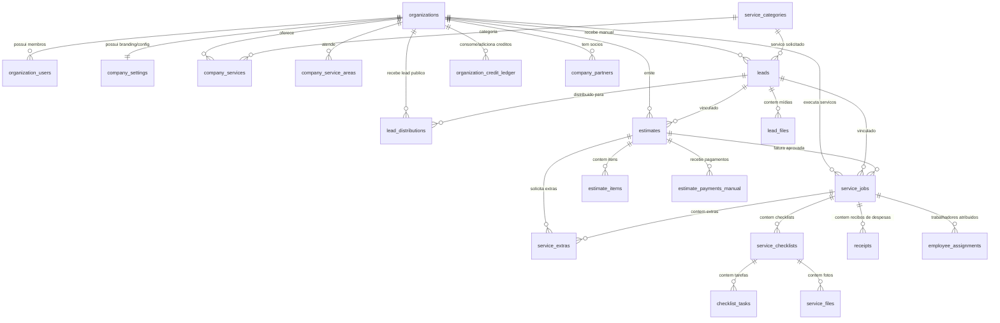

# Plano de Banco de Dados — HomeLeadPro SaaS Multiempresa (Versão 2)

> **Nota de nomenclatura e revisão:** o produto anteriormente chamado Barrigudo passa a ter o nome comercial HomeLeadPro. Esta versão 2 do plano de banco de dados ajusta as definições para garantir compatibilidade societária, distribuição de leads multi-tenant, e padronização lowercase.

---

## 1. Diagrama Geral do Banco (Relacionamentos)

---

## 2. Detalhamento Técnico das Tabelas

### 2.1. Núcleo Multi-Tenant & Equipe
* **`organizations`**: Registra as empresas cadastradas no SaaS. Status padronizados em lowercase: `active`, `inactive`, `suspended`.
* **`organization_users`**: Tabela pivot vinculando usuários autenticados (`auth.users`) à sua organização e ao seu papel correspondente (`super_admin`, `owner`, `admin`, `worker`). Status: `active`, `inactive`.
* **`company_settings`**: Armazena dados comerciais e chaves de recebimento. Dados sensíveis (Zelle/SMS API keys) são protegidos via RLS contra vazamento para terceiros e funcionários comuns.

### 2.2. Serviços & Cobertura Geográfica
* **`service_categories`**: Categoria de serviços (ex: plumbing, roofing, painting).
* **`company_services`**: Relação de serviços oferecidos por empresa.
* **`us_locations`**: Banco nacional de CEPs, cidades, estados e coordenadas geográficas dos EUA.
* **`company_service_areas`**: Define a área de atendimento da empresa via lista de ZIPs ou raio em milhas.

### 2.3. Leads, Distribuição e Créditos (Multi-Tenant Seguro)
* **`leads`**: Centraliza contatos e vistorias. Status em lowercase: `new`, `distributed`, `contacted`, `converted`, `lost`, `rejected`, `closed`. Urgência: `standard`, `medium`, `high`, `emergency`. 
  * *Lead Público:* A coluna `organization_id` permanece `NULL`. A vinculação às empresas que compram o lead é feita unicamente em `lead_distributions`.
  * *Lead Manual:* Criado diretamente pela empresa, recebendo o `organization_id` da empresa criadora.
* **`lead_distributions`**: Representa a venda e distribuição de um lead público para empresas. Possui chave única `unique(lead_id, organization_id)` impedindo cobranças duplicadas do mesmo lead para a mesma empresa. Status: `distributed`, `charged`, `viewed`, `contacted`, `converted`, `lost`.
* **`organization_credit_ledger`**: Razão de movimentação financeira de créditos. Possui constraint `balance_after >= 0` que bloqueia saldos negativos.

### 2.4. Faturamento, Propostas e Pagamentos
* **`estimates`**: Propostas/faturas comerciais. Status: `draft`, `sent`, `viewed`, `approved`, `rejected`, `paid`, `cancelled`. Não expõe campos de lucro aos instaladores. Contém `public_token` para links de visualização pública controlada por RPC.
* **`estimate_items`**: Itens individuais de faturamento de um estimate.
* **`estimate_payments_manual`**: Pagamentos manuais registrados por gerentes (Zelle, Venmo, cheque, etc.).

### 2.5. Execução, Checklists e Mídias
* **`service_jobs`**: Ordens de serviço. Status: `scheduled`, `in_progress`, `completed`, `cancelled`.
* **`service_checklists`** e **`checklist_tasks`**: Listas de verificação para o instalador.
* **`service_extras`**: Custos extras solicitados em campo. Status: `pending`, `approved`, `rejected`, `cancelled`.
* **`service_files`**: Mídias enviadas. Comprovantes de campo possuem controle de visibilidade (`internal`, `client`, `public_portfolio`).

### 2.6. Sócios, Assignments e Reviews
* **`receipts`**: Comprovantes de despesas com materiais. Só processa divisão financeira se a soma dos sócios ativos da organização for exatamente 100%.
* **`company_partners`**: Sócios da organização. Permite cadastrar rascunhos de sócios com soma de participação inferior a 100%, mas a trigger impede que ultrapasse 100%. A função `validate_partner_shares_complete` valida se a soma dos sócios ativos é exatamente 100% antes de liberar rateios financeiros.
* **`employee_assignments`**: Cadastro de instaladores atribuídos a jobs. Libera o endereço do cliente para o trabalhador se autorizado.
* **`reviews`**: Avaliações deMassachusetts. **Mantém colunas `user_name` e `body` intactas** para compatibilidade com o frontend atual. Adiciona colunas de relacionamento (`organization_id`, `lead_id`, `service_job_id`) e aprovação (`public_approved`, `is_hidden`). Torna a coluna original `user_id` opcional (`nullable`) para permitir avaliações públicas sem login.
* **`audit_logs`**: Trilha de auditoria imutável de eventos importantes.
