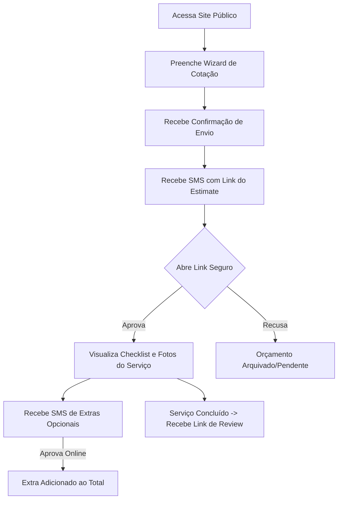

# Documento Mestre do Produto — HomeLeadPro SaaS Multiempresa

> **Nota de nomenclatura:** o produto anteriormente chamado Barrigudo passa a ter o nome comercial HomeLeadPro. Esta atualização altera apenas os documentos de planejamento, sem refatoração técnica no código.

---

## 1. Resumo Executivo
O **HomeLeadPro** é uma plataforma de Software como Serviço (SaaS) multiempresa voltada para o mercado de serviços residenciais nos Estados Unidos (inspirada em plataformas como Angi Leads e Thumbtack). O sistema atua em duas frentes complementares: captação de leads qualificados através de um site público interativo e distribuição inteligente desses leads para empresas parceiras com base em especialidade, localização e créditos. 

Inicialmente, a plataforma será validada e operada pelos fundadores para refinar regras e processos de distribuição. Contudo, desde a primeira linha de código no banco de dados, o HomeLeadPro é projetado sob a arquitetura multi-tenant (multiempresa) para permitir a comercialização do software a terceiros de forma escalável e segura.

---

## 2. Visão Geral do Produto
O ecossistema do HomeLeadPro funciona através de um fluxo contínuo de ponta a ponta:
1. **Captação:** O cliente final solicita um serviço no site público através de um assistente progressivo (*wizard*).
2. **Qualificação e Distribuição:** O lead é validado e encaminhado em tempo real para até $N$ empresas ativas que atendam ao serviço e à localização solicitada e que possuam saldo suficiente.
3. **Cobrança:** A plataforma debita automaticamente o valor do lead do saldo pré-pago das empresas selecionadas.
4. **CRM e Negociação:** As empresas recebem as informações do lead e entram em contato com o cliente via SMS mascarado e área restrita. O sistema permite criar orçamentos (*estimates*), revisar itens e termos, e enviá-los ao cliente.
5. **Execução e Fechamento:** Após aprovação do orçamento, gera-se um checklist de execução com upload de mídias, gestão de despesas/recibos, controle de extras aprovados e fechamento financeiro, incluindo a partilha de lucros entre sócios.

---

## 3. Objetivo Comercial
* **Validação Inicial:** Apoiar a operação prática dos fundadores e de seu irmão no mercado de serviços residenciais nos EUA, ajustando algoritmos de precificação, fluxo de SMS e usabilidade do checklist.
* **Monetização e Escalabilidade:** Transformar a infraestrutura em um SaaS multi-tenant comercializável, permitindo que qualquer empresa de serviços residenciais nos EUA crie sua própria conta, configure sua área de atuação, gerencie seus funcionários e sócios e compre créditos de leads captados pela plataforma central.

---

## 4. Público-Alvo
1. **Clientes Finais:** Proprietários de imóveis nos EUA que necessitam de reparos ou reformas rápidas (ex: hidráulica, pintura, calhas) e buscam atendimento ágil sem burocracias ou necessidade de criação de conta.
2. **Owners de Empresas (Parceiros SaaS):** Empreendedores de serviços residenciais nos EUA que buscam canais eficientes de aquisição de leads e um CRM operacional completo para campo.
3. **Trabalhadores/Funcionários de Campo:** Profissionais que realizam o serviço prático na residência do cliente e utilizam o celular para preencher checklists e registrar problemas.
4. **Super Administradores (Fundadores):** Gestores da plataforma responsáveis pela saúde do sistema, regulação de créditos, moderação de depoimentos e suporte técnico.

---

## 5. Modelo de Negócio
O modelo de receita principal do HomeLeadPro assenta-se na **venda pré-paga de leads**. 
* **Créditos Recarregáveis:** As empresas ativas na plataforma compram pacotes de créditos. A distribuição de leads ocorre apenas se a empresa possuir saldo suficiente para cobrir o custo do lead.
* **Monetização por Lead Distribuído:** Cada lead qualificado é vendido para até $N$ empresas (média recomendada de 3). A cobrança ocorre no momento do recebimento do lead pela empresa, independente do fechamento do contrato com o cliente final. Não há taxas ou split sobre o valor total do serviço de campo no MVP.

---

## 6. Tipos de Usuários e Permissões

A tabela abaixo define os perfis de acesso da plataforma:

| Perfil de Usuário | Nível de Acesso | Escopo de Visualização | Ações Permitidas |
| :--- | :--- | :--- | :--- |
| **Super Admin** | Total (Plataforma) | Global (Todas as Empresas e Leads) | Configurar taxas globais, gerenciar empresas, adicionar créditos, criar categorias e ver logs gerais. |
| **Owner da Empresa** | Total (Empresa) | Restrito à própria Organização | Cadastrar sócios/funcionários, configurar área de cobertura, gerenciar créditos, emitir estimates e ver relatórios financeiros. |
| **Admin da Empresa** | Parcial (CRM) | Restrito à própria Organização | Gerenciar leads recebidos, criar/editar estimates, interagir com clientes e acompanhar serviços. Não gerencia sócios. |
| **Funcionário** | Campo | Restrito aos Serviços Atribuídos | Visualizar serviços específicos, atualizar checklists, anexar mídias e fazer comentários. Não vê dados financeiros ou endereços não autorizados. |
| **Cliente Final** | Link Seguro (Sem Login) | Apenas as próprias Faturas e Extras | Visualizar estimates, aprovar/recusar propostas e extras, submeter reviews e visualizar fotos liberadas. |

---

## 7. Fluxo do Cliente Final

---

## 8. Fluxo da Empresa
1. **Configuração Inicial:** O Owner acessa o painel, cadastra a empresa, insere o percentual societário (100%), define a área de atendimento (ZIP codes e raio em milhas) e seleciona os serviços executados.
2. **Aquisição de Leads:** O saldo é carregado. Quando um lead correspondente entra no sistema, o crédito é debitado e o lead aparece na caixa de entrada da empresa.
3. **Orçamentação:** O profissional utiliza a IA auxiliar ou preenche manualmente os itens do estimate. O sistema gera a fatura e um link seguro é enviado via SMS para o cliente.
4. **Execução:** O estimate é aprovado pelo cliente. O serviço entra em andamento e é atribuído a um funcionário. O funcionário atualiza o checklist em campo.
5. **Conciliação e Divisão:** O serviço é concluído. O pagamento manual é registrado no painel. O lucro líquido é calculado deduzindo-se despesas e faturas de compras, e a partilha entre os sócios é atualizada no ledger financeiro.

---

## 9. Fluxo do Super Admin
1. **Monitoramento:** Acompanhamento do volume de leads gerados e distribuição por região dos EUA.
2. **Moderação:** Ativação/desativação de empresas com base em denúncias ou falta de licença/insurance.
3. **Gestão de Preços:** Criação de regras tarifárias para leads (ex: serviços de "Roofing" possuem custo de lead maior que "Drywall Repair").
4. **Financeiro Global:** Adição manual de créditos promocionais ou ajustes de transações financeiras das empresas.

---

## 10. Site Público
A porta de entrada do HomeLeadPro. Deve ter uma aparência elegante e moderna com o sistema de cores do [index.css](file:///c:/Desenvolvimento/SiteIhago/Site/src/index.css) (azul-marinho profundo e glassmorphism).
* **Página Inicial:** Seções explicativas das categorias atendidas, depoimentos moderados de clientes e mapas de calor exibindo a cobertura de atendimento.
* **Busca de Serviços:** Campo com autocompletar inteligente para que o cliente selecione com facilidade o tipo de serviço.
* **Wizard de Solicitação:** Formulário dividido em passos com animações fluidas (`framer-motion`), validação instantânea de geolocalização e upload nativo de mídias compactadas.
* **Portfólio e Avaliações:** Fotos profissionais de serviços realizados, controladas e aprovadas pelo Super Admin.

---

## 11. Leads Públicos e Manuais
* **Campos do Lead Público:** Nome do cliente, telefone, e-mail, ZIP Code, endereço completo, tipo de serviço, descrição detalhada do problema, fotos/vídeos anexados, urgência e melhor horário de contato.
* **Lead Manual:** Criado pelo administrador/owner diretamente no painel. É útil quando o cliente telefona ou fecha contrato diretamente sem usar o site público. Possui os mesmos campos do lead público, mas pula a etapa de distribuição automática e bloqueio de créditos, vinculando-se diretamente à organização criadora.

---

## 12. Distribuição Automática de Leads
O algoritmo de distribuição automática de leads analisa os seguintes critérios de compatibilidade:
* **Especialidade:** A empresa deve cobrir a categoria/subcategoria do lead solicitado.
* **Raio de Atendimento:** O ZIP code do lead deve estar dentro do raio em milhas configurado pela empresa ou listado diretamente em seus códigos ZIP atendidos.
* **Status Financeiro:** A empresa deve estar ativa e possuir saldo pré-pago maior ou igual ao preço calculado do lead.
* **Concorrência Máxima:** O lead é encaminhado para até $N$ empresas compatíveis (onde $N$ é um parâmetro global ou por categoria configurado pelo Super Admin). Se houver mais empresas compatíveis do que vagas, o sistema prioriza por ordem de saldo disponível, rotação justa ou prioridade premium.

---

## 13. Cobrança por Lead e Créditos
* **Modelo Pré-pago Estrito:** Nenhuma empresa pode receber leads se seu saldo de créditos estiver zerado ou for menor que o custo do lead. Não existe saldo negativo.
* **Débito Automático:** Assim que a empresa é selecionada e recebe o lead em sua caixa de entrada privada, o valor do lead é deduzido instantaneamente de sua conta.
* **Sem Reembolsos Automáticos:** Inicialmente, não haverá sistema de disputa ou estorno de leads. O lead recebido é considerado cobrado.
* **Histórico de Transações:** Um log imutável de transações financeiras (*Ledger*) deve registrar cada entrada de crédito (adicionada manualmente pelo Super Admin) e cada débito (com ID do lead correspondente).

---

## 14. Regras de Preço do Lead
O Super Admin configura tabelas de preços com base em regras flexíveis de precificação para garantir margens de lucro adequadas. O preço varia por:
1. **Categoria de Serviço:** Serviços de alta complexidade (ex: *Roofing completo*, *Remodeling*) possuem custos de lead mais altos.
2. **Volumetria/Tamanho:** O cliente informa a quantidade no wizard (ex: "instalar 1 janela" vs "instalar 15 janelas"). O sistema atribui classes de tamanho (Small, Medium, Large) que multiplicam ou alteram o valor base do lead.
3. **Urgência:** Leads marcados como "Emergency" (atendimento imediato) sofrem acréscimo tarifário.
4. **Geografia:** Regiões com maior poder aquisitivo ou escassez de profissionais podem ter multiplicadores de ZIP code específicos.

---

## 15. Proteção do Telefone do Cliente
Para mitigar a evasão do ecossistema (onde a empresa obtém o número e contorna a plataforma), o HomeLeadPro adota proteção de telefone:
* **Mascaramento de Chamadas/SMS:** A empresa visualiza um número virtual temporário fornecido pela plataforma. Todas as ligações e SMS direcionados a esse número virtual são encaminhados para o número real do cliente final, e vice-versa.
* **Liberação de Contato:** Por padrão, o número real permanece oculto. Caso a empresa necessite do número direto para emissão de licenças públicas municipais ou autorizações, a liberação deve seguir regras contratuais ou ocorrer após a aprovação formal do estimate por parte do cliente.

---

## 16. SMS e Mensagens
O SMS é o canal corporativo principal de comunicação com o cliente nos EUA.
* **Twilio SMS Gateway:** Utilizado para gerenciar todas as mensagens enviadas e recebidas.
* **Intermediação de Chat:** Toda conversa iniciada pela empresa no painel administrativo é convertida em SMS e enviada ao celular do cliente. As respostas por SMS do cliente são recebidas por webhooks do Twilio e injetadas no histórico de mensagens do lead/serviço no painel da empresa.
* **Mensagens Transacionais Automáticas:** Envio de links seguros para visualização de orçamentos, aprovação de extras e formulário de review final.

---

## 17. Área Privada da Empresa
Um painel exclusivo estruturado com componentes elegantes de design.
* **CRM de Leads:** Gestão do funil de vendas, acompanhamento de propostas enviadas e mensagens trocadas com o cliente.
* **Editor de Estimates:** Criação de faturas profissionais com recálculo automático de taxas fiscais de Massachusetts.
* **Agenda de Projetos:** Visualização das datas de vistorias técnicas e início de obras.
* **Gestão de Equipe e Sócios:** Cadastro de funcionários de campo e distribuição de percentual societário.
* **Módulo Financeiro Interno:** Controle de pagamentos parciais, despesas com fornecedores e conciliação societária.

---

## 18. Área de Atendimento da Empresa
O Owner pode cadastrar sua cobertura geográfica através de três modelos de seleção:
1. **Lista de ZIP Codes:** Digitação direta dos códigos postais que a empresa atende.
2. **Raio Geográfico:** Seleção de um ZIP code de referência e um raio em milhas (ex: ZIP 02101 + 25 milhas de raio).
3. **Limites Municipais:** Seleção de cidades e estados específicos da base de dados americana.

---

## 19. Busca Inteligente de Localização
O sistema conta com um banco relacional contendo os estados, cidades e ZIP codes dos EUA (com suas respectivas latitudes e longitudinais). O campo de localização no wizard público e no admin realiza pesquisas rápidas em tempo real com base em texto parcial (ex: o usuário digita "Port" e o sistema retorna sugestões válidas como "Portland, ME", "Portsmouth, NH" ou "Port Chester, NY"). Isso evita erros de preenchimento e falhas no matching de leads.

---

## 20. Estimates / Orçamentos
O motor de orçamentos permite gerar faturas comerciais em PDF altamente profissionais e links web interativos:
* **Dados Obrigatórios:** Dados fiscais e comerciais da empresa emissora, dados de contato do cliente final, detalhamento técnico do serviço, lista de itens com quantidades e valores unitários.
* **Cálculos Matemáticos:** Aplicação de subtotal, descontos comerciais aplicados, taxas alfandegárias/impostos locais e saldo pendente.
* **Aprovação Online:** O link público seguro não exige login. O cliente visualiza a fatura com estética premium, clica em "Approve" e assina digitalmente com o dedo ou mouse. Os status do estimate transitam de `Draft` -> `Sent` -> `Viewed` -> `Approved`/`Rejected` -> `Paid`.

---

## 21. IA no MVP
O uso de Inteligência Artificial no MVP será focado como um assistente de produtividade textual para a empresa, e não como tomador de decisões:
* **Assistente de Emissão:** A partir da descrição simplificada do problema fornecida pelo lead (ex: *"Vazamento sob a pia da cozinha molhando o gabinete"*), o profissional solicita sugestões de descrições comerciais para o estimate, itens orçamentários estimados (com quantitativos comuns) e checklists de instalação apropriados.
* **Revisão Humana Obrigatória:** A IA gera rascunhos em campos de texto editáveis. Nada é salvo no banco de dados ou enviado via SMS para o cliente sem a aprovação manual do profissional da empresa.

---

## 22. Checklist de Execução
Ao ter um estimate aprovado, o serviço entra em fase de execução. Um checklist detalhado é gerado:
* **Montagem do Checklist:** Criado a partir de templates da empresa, itens do orçamento ou gerado pela IA (ex: *"1. Remover gabinete antigo, 2. Limpar área, 3. Instalar novas conexões PVC, 4. Testar vazamentos por 15 min"*).
* **Interação de Campo:** O funcionário atribuído marca as tarefas concluídas, registra logs de horários, insere fotos detalhadas do progresso e adiciona anotações técnicas.

---

## 23. Extras
Se durante a execução do serviço surgir uma necessidade não prevista no estimate inicial (ex: *tubulação apodrecida atrás da parede*):
1. **Lançamento:** O profissional lança um item "Extra" no painel, contendo descrição, valor, fotos comprobatórias do problema e motivo.
2. **Envio e Aprovação:** O sistema envia um SMS com o link do Extra para o cliente. O cliente aprova a alteração com um clique.
3. **Atualização Financeira:** O valor do Extra aprovado é automaticamente somado ao total geral da fatura do serviço, atualizando o saldo final devido pelo cliente.

---

## 24. Arquivos/Fotos/Vídeos
O sistema gerencia todas as mídias coletadas durante o ciclo de vida do serviço:
* **Upload e Captura:** Suporte para upload de arquivos locais, PDFs de licenças municipais e acesso direto à câmera do celular para fotos e vídeos em tempo real.
* **Compactação Ativa:** Todas as imagens capturadas são reduzidas e compactadas no navegador (`browser-image-compression` no frontend) antes do upload para economizar armazenamento no Supabase Storage e evitar lentidão em redes móveis de campo.
* **Níveis de Visibilidade:**
  * `Internal Only`: Visível apenas para a equipe da empresa (ex: anotações técnicas de falhas).
  * `Client Visible`: Compartilhado com o cliente no link seguro (ex: fotos de antes e depois, extras).
  * `Public Portfolio`: Aprovado para exibição na galeria de portfólio do site público (apenas sob moderação do Super Admin no MVP).

---

## 25. Recibos e Despesas
Gestão de custos e comprovantes fiscais no painel da empresa:
* **Registro de Recibos:** O profissional tira fotos de comprovantes de compras de materiais (ex: Home Depot), insere o valor total, fornecedor e seleciona a forma de pagamento (cartão corporativo, dinheiro).
* **Tipos de Despesas:**
  1. *Reembolsável:* O material foi comprado pela empresa, mas deve ser cobrado do cliente final na fatura.
  2. *Internal Cost (Incluso):* O custo do material já estava contemplado no orçamento inicial; afeta diretamente a margem de lucro líquido do serviço.
  3. *Split com Sócio:* Custos de insumos divididos proporcionalmente com base na cota dos sócios da empresa.

---

## 26. Sócios e Divisão Financeira
O HomeLeadPro gerencia a partilha interna de lucros e despesas das empresas cadastradas:
* **Configuração Societária:** O Owner cadastra os sócios e define a porcentagem de participação de cada um.
* **Validação Obrigatória:** O sistema impede o salvamento das configurações caso a soma dos percentuais societários seja diferente de **exatamente 100%** (ex: Sócio A 50%, Sócio B 30%, Sócio C 20%).
* **Cálculo de Dividendos:** Cada serviço concluído gera um cálculo de lucro líquido (Receita Total - Custos/Materiais). O sistema distribui virtualmente a parcela de lucro e dívidas de despesas de cada sócio na planilha financeira interna da empresa.

---

## 27. Financeiro sem Pagamento Online
No MVP do HomeLeadPro, **não haverá gateway de pagamento automático online** (sem processamento direto de Stripe, Square ou cartões via sistema).
* **Registro Manual:** O financeiro opera em regime de conciliação manual. O administrador insere os valores recebidos fora da plataforma, especificando a data e o método de recebimento.
* **Cálculo de Saldo Devido:** O sistema abate os pagamentos parciais registrados do total geral do estimate, alterando os status financeiros da fatura de `Unpaid` para `Partially Paid` ou `Paid` de forma automática.

---

## 28. Métodos Manuais de Recebimento
Cada empresa configura quais métodos manuais aceita trabalhar nos EUA. As opções aceitas são:
* **Zelle** (e-mail ou telefone cadastrado da empresa)
* **Venmo** (username corporativo)
* **Cash App** (Cashtag)
* **Check** (dados para emissão nominais à empresa)
* **Cash** (dinheiro em espécie)
* **Bank Transfer** (dados de conta e número de roteamento bancário)
* **External Card Reader** (maquininhas de cartão físicas externas da empresa)

Essas instruções de pagamento manual e chaves de recebimento são apresentadas no rodapé da fatura pública no link seguro do cliente.

---

## 29. Review e Google Review
Ao finalizar um serviço no painel administrativo:
1. **Disparo de SMS:** Se a configuração da empresa estiver ativa para revisões automáticas, o sistema envia um SMS de agradecimento ao cliente contendo um link de feedback.
2. **Avaliação Interna:** O cliente pode deixar um depoimento e nota estrelas. Se a nota for excelente (ex: 5 estrelas), o sistema exibe um redirecionamento amigável sugerindo que o cliente replique a avaliação no **Google Review** da empresa parceira através de link configurado nas configurações.
3. **Moderação:** As avaliações recebidas são exibidas na fila de moderação da empresa e podem ser marcadas para exibição pública, dependendo de aprovação final do Super Admin.

---

## 30. Configurações da Empresa
* **Perfil Corporativo:** Nome da empresa, logotipo oficial, e-mail, telefone, site corporativo, endereço comercial, License Number (registro profissional estadual) e apólice de Insurance (seguro contra acidentes).
* **Definições Financeiras:** Contas de depósito para Zelle/Venmo, sócios e porcentagens, e taxa padrão de impostos municipais.
* **SMS e Templates:** Customização dos textos automáticos enviados para emissão de estimate, extras, avisos de visita e pedidos de review.

---

## 31. Configurações da Plataforma
Painel exclusivo do Super Admin para controle global do ecossistema:
* **Categorias e Preços:** Criação de novos ramos de atuação (ex: *Landscaping*, *Gutter cleaning*) e atribuição de custos base de leads.
* **Moderação de Empresas:** Autenticação e aprovação de novos cadastros e bloqueios preventivos.
* **Logs do Sistema:** Relatórios de falhas de envio de SMS, tentativas de login malsucedidas de administradores e transações de créditos.

---

## 32. Dashboards

### Dashboard do Super Admin:
* Quantidade de leads coletados e distribuídos nas últimas 24h / 7 dias / 30 dias.
* Receita bruta gerada com a venda de leads.
* Fila de leads pendentes sem nenhuma empresa compatível na região.
* Ranking das empresas com maior consumo de leads e saldos de créditos atuais.

### Dashboard da Empresa:
* Total de leads recebidos e gastos operacionais acumulados com a aquisição de contatos.
* Conversão comercial (Leads Recebidos vs Orçamentos Aprovados).
* Volume total faturado, valores recebidos e saldo pendente a receber de clientes ativos.
* Lucro líquido acumulado da empresa e saldo individual a receber por sócio.

---

## 33. Mobile e Desktop
O HomeLeadPro é projetado sob o conceito de **Responsividade Estrita**:
* **Mobile-First para Campo:** A interface do trabalhador de campo (checklist, comentários e upload de mídias) e a página pública do cliente final (visualização de orçamentos e aprovação de extras) são 100% otimizadas para smartphones e conexões móveis lentas.
* **Desktop para Escritório:** As interfaces mais densas (editor complexo de estimates, relatórios avançados e gráficos societários) contam com layouts em grid expandido para uso confortável em telas grandes.

---

## 34. MVP Recomendado
O MVP do HomeLeadPro deve focar estritamente nas seguintes features:
* Multi-tenant básico de organizações e perfis (Owner, Admin, Funcionário).
* Site público de captação de leads com formulário wizard.
* Sistema de distribuição geográfica básica por ZIP code e raio de cobertura.
* Controle de saldo de créditos pré-pago das empresas com débito automático por lead compatível.
* Conversação básica empresa-cliente intermediada por SMS (mascaramento simples de número).
* Editor e gerador de estimates (PDF e Link Seguro sem login).
* Checklist de tarefas do serviço com upload de fotos compactadas.
* Registro manual de despesas e comprovantes societários.
* Painéis gerenciais do Super Admin e da empresa.

---

## 35. Pós-MVP
Recursos planejados para fases posteriores do produto:
* Processamento e liquidação de pagamentos online integrados (Stripe/Square).
* Cobranças automáticas de recarga de créditos de leads baseadas em saldo mínimo.
* Sistema de disputas de leads (reembolso por leads falsos ou dados inválidos).
* IA avançada capaz de escanear fotos residenciais de danos e propor itens de orçamentos estruturados.
* Divisão automática de assinaturas SaaS mensais recorrentes para liberação do painel.
* Aplicativo móvel nativo (iOS e Android) para os funcionários de campo.

---

## 36. Ordem Recomendada de Implementação
A implementação deve seguir os princípios do desenvolvimento defensivo para garantir estabilidade:
1. **Fase 1 (Documentação):** Finalização e assinatura deste documento mestre do produto.
2. **Fase 2 (Estrutura do Banco):** Criação das tabelas relacionais do Supabase PostgreSQL com chaves estrangeiras apropriadas.
3. **Fase 3 (Blindagem RLS):** Aplicação de políticas Row Level Security (RLS) para evitar vazamento de dados entre empresas.
4. **Fase 4 (CRM e Multi-tenant):** Implementação da camada de autenticação, organizações e controle de permissões.
5. **Fase 5 (Captação e Distribuição):** Construção do wizard de leads público, algoritmo de matching regional e débito de créditos.
6. **Fase 6 (SMS Gateway):** Integração do Twilio com histórico de chats e mascaramento de chamadas.
7. **Fase 7 (Orçamentos):** Editor de estimates com links seguros e geração de PDF.
8. **Fase 8 (Execução e Checklist):** Tela do funcionário com checklist e uploads.
9. **Fase 9 (Financeiro Societário):** Lógica societária de 100%, recibos e conciliação manual.
10. **Fase 10 (Reviews e Ajustes):** Sistema de Google Reviews e refatoração final de estabilidade visual.

---

## 37. Riscos Técnicos
* **Vazamento de Dados Multi-tenant:** Sem RLS ativado de forma cirúrgica no Supabase, a chave anônima da aplicação pode ser usada por terceiros para listar dados confidenciais de outras empresas.
* **Instabilidade de Compilação Híbrida:** A coexistência de arquivos Next.js e Vite SPA no diretório cria ambiguidades e pode quebrar builds de produção.
* **Gargalos em Redes de Campo:** Uploads de vídeos e imagens não compactados por instaladores em áreas de sinal móvel fraco podem falhar de forma silenciosa ou sobrecarregar a largura de banda do cliente.
* **Evasão da Plataforma:** Empresas tentarem burlar a compra de leads descobrindo e guardando o número real do cliente por fora do proxy.

---

## 38. Pontos que Precisam de Atenção
* **Cálculo da Soma Societária:** A validação que barra o salvamento das porcentagens dos sócios caso não totalizem exatamente 100% deve rodar tanto no frontend (feedback visual instantâneo) quanto no backend/Supabase Trigger (garantia de consistência lógica contra inserts manuais via API).
* **Compactação de Vídeo:** Vídeos pesados anexados por funcionários devem ter limites estritos de tamanho (ex: max 15 segundos) e sofrer redução de bitrate do lado do cliente para não comprometer custos de storage.

---

## 39. Perguntas Pendentes
1. Como lidaremos com leads de regiões geográficas em que nenhuma empresa atende no momento? O lead será guardado em fila ou o cliente receberá aviso imediato de indisponibilidade?
2. Caso um lead possua dados de telefone inválidos ou seja um spam não pego pelo honeypot, qual será o processo burocrático para a empresa pedir reembolso do crédito cobrado ao Super Admin?
3. O número virtual de SMS do Twilio usado para mascarar o telefone será um número centralizado único da plataforma HomeLeadPro ou cada empresa contratante do SaaS terá um número dedicado próprio configurado?

---

## 40. Conclusão
O HomeLeadPro possui todas as bases funcionais e estéticas necessárias para se destacar no mercado americano de contratação de serviços residenciais. A estruturação robusta contida neste Documento Mestre do Produto garante que a equipe de engenharia possua a especificação completa para iniciar o desenvolvimento prático de forma segura, mantendo a consistência dos dados, a segurança da arquitetura multi-tenant e o visual premium intacto.

---

## Mapa de Módulos
1. **Módulo de Organizações (Multi-Tenant):** Cadastro de empresas, convites e atribuição de papéis de equipe.
2. **Módulo de Captação Pública:** Landing page e wizard de cotação progressivo com checagem de ZIP.
3. **Módulo de Distribuição e Matching:** Motor de distribuição geográfica e regras de concorrência.
4. **Módulo de Créditos (Ledger):** Carteira pré-paga das empresas e logs de débitos de leads.
5. **Módulo SMS Proxy:** Mascaramento de chamadas e mensagens via Twilio.
6. **Módulo de Estimates:** Editor de faturas profissionais, gerador de PDF e link de aprovação digital.
7. **Módulo de IA Auxiliar:** Chat de apoio para geração de checklists e estimativas.
8. **Módulo de Execução (Checklist):** Controle de tarefas em campo e anexação de arquivos.
9. **Módulo Societário:** Divisão percentual de lucros e controle de recebimentos manuais.
10. **Módulo de Depoimentos:** Coleta de reviews internos e redirecionamento para Google Review.

---

## Mapa Inicial de Tabelas Sugeridas

```mermaid
erDiagram
    organizations {
        uuid id PK
        text name
        text slug
        timestamp created_at
    }
    organization_users {
        uuid id PK
        uuid user_id FK
        uuid organization_id FK
        text role
        timestamp created_at
    }
    company_settings {
        uuid organization_id PK, FK
        text company_name
        text logo_url
        text phone
        text email
        text address
        text license_number
        text insurance_info
        numeric default_tax_rate
        text default_terms
        boolean request_reviews
        text google_review_link
    }
    leads {
        uuid id PK
        text full_name
        text email
        text phone
        text zip
        text city
        text state
        text selected_service
        text description
        text urgency
        text status
        timestamp created_at
    }
    lead_distributions {
        uuid id PK
        uuid lead_id FK
        uuid organization_id FK
        numeric cost_debited
        timestamp distributed_at
    }
    organization_credits {
        uuid id PK
        uuid organization_id FK
        numeric amount
        text transaction_type
        uuid reference_id
        timestamp created_at
    }
    estimates {
        uuid id PK
        uuid organization_id FK
        uuid lead_id FK
        text client_name
        text client_email
        text client_phone
        text client_address
        text status
        numeric subtotal
        numeric tax_rate
        numeric discount_amount
        numeric total_amount
        numeric amount_paid
        numeric balance_due
        text public_token
        timestamp created_at
    }
    estimate_items {
        uuid id PK
        uuid estimate_id FK
        text description
        numeric quantity
        numeric unit_price
        numeric total_price
    }
    service_checklists {
        uuid id PK
        uuid estimate_id FK
        uuid assigned_worker_id FK
        timestamp started_at
        timestamp completed_at
    }
    checklist_tasks {
        uuid id PK
        uuid checklist_id FK
        text description
        boolean is_completed
        timestamp completed_at
    }
    service_extras {
        uuid id PK
        uuid estimate_id FK
        text description
        numeric amount
        text status
        timestamp approved_at
    }
    service_files {
        uuid id PK
        uuid estimate_id FK
        text file_url
        text visibility
        timestamp created_at
    }
    company_partners {
        uuid id PK
        uuid organization_id FK
        text partner_name
        numeric share_percentage
    }
```

---

## Mapa Inicial de Telas Sugeridas

### 🖥️ Telas Super Admin:
* **Dashboard Global:** Painel de saúde, leads ativos e faturamento consolidado de créditos.
* **Controle de Empresas:** Lista de parceiros SaaS cadastrados, ativação/inativação e auditoria de saldos.
* **Regras de Tarifas:** Editor de valores de leads por categorias residenciais e regiões postais.
* **Logs da Plataforma:** Telemetria de erros do Twilio, filas de e-mail e acessos de segurança.

### 💼 Telas da Empresa (Owner/Admin):
* **Dashboard Comercial:** Funil de leads, taxas de conversão e balanço financeiro geral.
* **Caixa de Leads:** Visualização dos leads adquiridos e controle de contatos dos clientes.
* **Editor de Estimates:** Manipulador dinâmico de faturas, taxas de impostos locais e descontos.
* **Configurações Fiscais/Sócios:** Cadastro societário (regra de 100%), Zelle e apólices de seguro.
* **Equipe e Funcionários:** Controle de cargos de equipe de escritório e campo.

### 📱 Telas do Funcionário (Trabalhador de Campo):
* **Lista de Serviços:** Fila de trabalhos atribuídos a ele com status e horários.
* **Checklist e Execução:** Visualizador de tarefas pendentes, botões de check e envio de comentários.
* **Envio de Mídias:** Câmera rápida para anexar fotos de progresso e problemas encontrados.

### 🌐 Telas Públicas (Cliente Final):
* **Landing Page:** Site de marketing corporativo com vitrine de portfólio e mapa de calor.
* **Wizard de Lead:** Formulário progressivo de cotação com envio de mídia de vistorias.
* **Fatura Pública:** Tela interativa em glassmorphism para assinatura e aprovação de orçamentos e extras.

---

## Mapa Inicial de Permissões

| Módulo/Tabela do Sistema | Super Admin | Owner da Empresa | Admin da Empresa | Funcionário | Cliente Final |
| :--- | :---: | :---: | :---: | :---: | :---: |
| **Configurações Globais** | Leitura/Escrita | Bloqueado | Bloqueado | Bloqueado | Bloqueado |
| **Créditos da Empresa** | Leitura/Escrita | Leitura | Leitura | Bloqueado | Bloqueado |
| **Estimates (Faturamento)** | Leitura | Leitura/Escrita | Leitura/Escrita | Bloqueado | Leitura/Aprovação |
| **Checklist de Execução** | Bloqueado | Leitura/Escrita | Leitura/Escrita | Leitura/Escrita | Leitura |
| **Dados Societários** | Bloqueado | Leitura/Escrita | Bloqueado | Bloqueado | Bloqueado |
| **Endereço do Lead** | Leitura | Leitura | Leitura | Leitura (Se Liberado) | Leitura |

---

## Recomendação da Primeira Implementação Real
Após a homologação e aprovação deste Documento Mestre do Produto, a primeira implementação prática recomendada é a **Fase 2 (Estrutura do Banco) e Fase 3 (Blindagem RLS)**. 

Essa etapa foca em criar as tabelas relacionais propostas no banco de dados Supabase PostgreSQL de desenvolvimento utilizando tipos e restrições corretas e habilitando imediatamente o Row Level Security (RLS) em todas as tabelas comerciais (`leads`, `estimates`, `estimate_items`). Isso garante que o desenvolvimento subsequente das telas e APIs de negócios nasça blindado contra vazamentos e acessos não autorizados entre organizações SaaS (multi-tenant) desde o primeiro momento, estabelecendo a base sólida e segura para o resto do projeto.

---

“Nenhuma alteração técnica foi feita. Apenas os documentos de planejamento foram atualizados para o nome comercial HomeLeadPro.”
