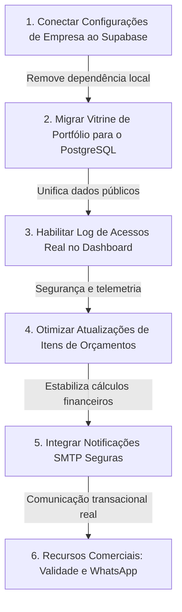

# Plano Funcional do Projeto Barrigudo

> **Status:** 🟢 Finalizado e Pronto para Discussão  
> **Papel:** Arquiteto de Software & Product Owner Sênior  
> **Data:** 18 de Maio de 2026  
> **Objetivo:** Mapeamento Funcional, Diagnóstico de Prontidão de Recursos e Plano de Novos Módulos  

---

## 1. Resumo do Produto Atual

O projeto **Barrigudo** hoje é um **MVP híbrido funcional de alta fidelidade** voltado para empresas de serviços residenciais (como calhas, telhados, pintura ou reformas em geral). 

Ele se divide em duas frentes integradas:
1.  **Site de Marketing & Captação (Público):** Uma landing page moderna com assistente dinâmico de orçamentação (*Quote Wizard*). O cliente digita suas necessidades, calcula estimativas de forma lúdica, insere imagens de sua residência e envia um lead estruturado para o backend.
2.  **CRM & Painel Operacional (Área Administrativa):** Um painel restrito para o administrador controlar o funil comercial. Ele visualiza novos leads, edita e emite orçamentos formais (com taxas e descontos calculados em tempo real), gera PDFs vetoriais com visualização profissional, gerencia a vitrine de depoimentos e portfólios, e registra faturamentos e pagamentos.

O design visual é o maior destaque do projeto: com estética escura de vidro (*glassmorphism*), cartões de alta qualidade visual, micro-animações robustas e transições suaves. Contudo, muitas dessas interfaces operam sob dados simulados (mocks) ou APIs locais em arquivos JSON estáticos ( Express local), necessitando de conexões estáveis ao banco remoto Supabase para atuar como um produto comercial real em produção.

---

## 2. Funcionalidades Existentes

Mapeamos minuciosamente todas as páginas, componentes e lógicas presentes no projeto, detalhando o estado de prontidão e caminhos de evolução.

---

### 🌐 Site Público

---

#### 1. Página Inicial / Landing Page
*   **Arquivo Principal:** [Index.tsx](file:///c:/Desenvolvimento/SiteIhago/Site/src/pages-spa/Index.tsx) e [Layout.tsx](file:///c:/Desenvolvimento/SiteIhago/Site/src/components/Layout.tsx)
*   **Status:** 🟢 **Pronto**
*   **O que faz:** Apresenta a marca, serviços principais, seções de diferenciais comerciais da empresa, central de avaliações integradas e mapa interativo da área de cobertura em Massachusetts.
*   **O que falta:** Integrar a leitura do catálogo de portfólios de forma 100% dinâmica a partir do banco de dados ao invés de arquivos estáticos.
*   **Vale a pena manter?** **Sim, com certeza.** O layout visual é extremamente moderno e possui alta capacidade de conversão de clientes.

---

#### 2. Galeria de Portfólio
*   **Arquivo Principal:** [Index.tsx](file:///c:/Desenvolvimento/SiteIhago/Site/src/pages-spa/Index.tsx) (Seções de Portfolio)
*   **Status:** 🟡 **Parcial**
*   **O que faz:** Exibe fotos de serviços residenciais concluídos pela empresa divididos por tags (ex: *gutter installation*, *cleaning*).
*   **O que falta:** Atualmente consome imagens de arquivos de mídia local ou do Express. Falta conectar a leitura da tabela `portfolio_items` do Supabase para permitir o cadastro em tempo real pelo painel.
*   **Vale a pena manter?** **Sim.** É essencial para passar autoridade aos visitantes do site.

---

#### 3. Depoimentos / Avaliações
*   **Arquivo Principal:** [Experiences.tsx](file:///c:/Desenvolvimento/SiteIhago/Site/src/pages-spa/Experiences.tsx) e componente de visualização na Home.
*   **Status:** 🟢 **Pronto**
*   **O que faz:** Página interativa onde o cliente que contratou os serviços pode preencher um formulário dinâmico multi-etapas, dar uma nota de 1 a 5 estrelas e redigir sua avaliação sobre o profissional.
*   **O que falta:** Conexão nativa para o administrador aprovar ou ocultar os depoimentos de forma visual antes de aparecerem na Home pública.
*   **Vale a pena manter?** **Sim.** Mecanismo de prova social engajador e interativo.

---

#### 4. Formulário Wizard de Orçamento
*   **Arquivo Principal:** [Quote.tsx](file:///c:/Desenvolvimento/SiteIhago/Site/src/pages-spa/Quote.tsx)
*   **Status:** 🟢 **Pronto**
*   **O que faz:** Um assistente progressivo composto por barra de porcentagem preenchida conforme o progresso. Contém validação Zip Code automática, campo oculto honeypot anti-spam, upload de fotos residenciais e compactador automático para reduzir tráfego móvel.
*   **O que falta:** Vincular o salvamento de múltiplos arquivos anexados à tabela `lead_files` correspondente no banco.
*   **Vale a pena manter?** **Sim, é a joia da coroa do frontend público.** Extremamente rico e intuitivo.

---

#### 5. Tela de Sucesso / Confirmação
*   **Arquivo Principal:** [Success.tsx](file:///c:/Desenvolvimento/SiteIhago/Site/src/pages-spa/Success.tsx)
*   **Status:** 🟢 **Pronto**
*   **O que faz:** Exibe animações de check verde, mensagem de confirmação de envio e orientações de prazos para que o cliente saiba que seu lead foi enviado.
*   **O que falta:** Botão opcional para iniciar um chat imediato com a empresa caso o lead seja de extrema urgência.
*   **Vale a pena manter?** **Sim.** Garante excelente experiência e encerramento do fluxo comercial.

---

#### 6. Sistema de Idiomas (Multilíngue)
*   **Arquivo Principal:** [LanguageContext.tsx](file:///c:/Desenvolvimento/SiteIhago/Site/src/context/LanguageContext.tsx)
*   **Status:** 🟢 **Pronto**
*   **O que faz:** Alterna instantaneamente o idioma de todo o site público e do cabeçalho entre Inglês e Português com base em dicionários locais de tradução.
*   **O que falta:** Traduzir também os campos de e-mails transacionais enviados ao cliente final de forma automatizada com base na preferência salva dele.
*   **Vale a pena manter?** **Sim.** Muito relevante para serviços residenciais focados na comunidade imigrante ou americana nos EUA.

---

#### 7. Outras Páginas Públicas (About, Cost Guide, Join, Services)
*   **Arquivos Principais:** `About.tsx`, `CostGuide.tsx`, `Join.tsx`, `Services.tsx`
*   **Status:** 🟢 **Pronto**
*   **O que faz:** Provê páginas ricas de apresentação corporativa, tabela detalhada explicativa de custos de mão de obra para dar clareza comercial ao cliente, e página para captação de novos profissionais e parceiros (*Join*).
*   **O que falta:** Pequenas conexões em botões de ação apontando para as rotas corretas.
*   **Vale a pena manter?** **Sim.** Enriquecem a relevância do domínio no Google (SEO) e tiram dúvidas recorrentes.

---

### 🔑 Área Administrativa

---

#### 1. Login Administrativo
*   **Arquivo Principal:** [AdminLogin.tsx](file:///c:/Desenvolvimento/SiteIhago/Site/src/pages-spa/admin/AdminLogin.tsx) e [UserContext.tsx](file:///c:/Desenvolvimento/SiteIhago/Site/src/context/UserContext.tsx)
*   **Status:** 🟢 **Pronto**
*   **O que faz:** Interface limpa para os administradores se autenticarem no CRM por meio do Google OAuth integrado ao Supabase Auth.
*   **O que falta:** Proteção visual contra redirecionamentos incorretos caso o usuário não esteja atrelado a nenhuma organização corporativa.
*   **Vale a pena manter?** **Sim.** O login social facilita o acesso de funcionários via contas corporativas do Google.

---

#### 2. Dashboard Principal
*   **Arquivo Principal:** [Dashboard.tsx](file:///c:/Desenvolvimento/SiteIhago/Site/src/pages-spa/admin/Dashboard.tsx)
*   **Status:** 🟢 **Pronto**
*   **O que faz:** Central de monitoramento com cartões de receita bruta, total de leads convertidos, gráficos de linhas financeiros interativos (`recharts`) e painel de controle contendo logs de segurança de acessos.
*   **O que falta:** Conectar os KPIs estáticos a consultas SQL reais agregadas diretamente do banco PostgreSQL de produção.
*   **Vale a pena manter?** **Sim.** É o centro de tomada de decisões comerciais do administrador.

---

#### 3. Inbox de Leads (CRM)
*   **Arquivo Principal:** [Inbox.tsx](file:///c:/Desenvolvimento/SiteIhago/Site/src/pages-spa/admin/Inbox.tsx) e [LeadDetail.tsx](file:///c:/Desenvolvimento/SiteIhago/Site/src/pages-spa/admin/LeadDetail.tsx)
*   **Status:** 🟢 **Pronto**
*   **O que faz:** Lista completa de cotações recebidas, categorizadas por status, permitindo ao administrador inspecionar fotos de vistorias, dados de endereço e aceitar/rejeitar o contato em um clique.
*   **O que falta:** Um botão de ação direta para "Converter Lead em Orçamento", transferindo os dados para a fatura de faturamento sem redigitação.
*   **Vale a pena manter?** **Sim.** Design muito premium e otimizado com gavetas interativas (*drawers*).

---

#### 4. Gerenciamento de Orçamentos / Estimates List
*   **Arquivo Principal:** [EstimatesList.tsx](file:///c:/Desenvolvimento/SiteIhago/Site/src/pages-spa/admin/EstimatesList.tsx)
*   **Status:** 🟢 **Pronto**
*   **O que faz:** Grid detalhado apresentando todos os orçamentos emitidos, status de conciliação de faturas (Draft, Sent, Viewed, Approved, Paid) e balanço de valores residuais.
*   **O que falta:** Filtro avançado para exibir orçamentos vencidos baseado no campo `valid_until`.
*   **Vale a pena manter?** **Sim.** Fundamental para o controle de cobranças de faturas ativas.

---

#### 5. Editor de Orçamentos
*   **Arquivo Principal:** [EstimateEditor.tsx](file:///c:/Desenvolvimento/SiteIhago/Site/src/pages-spa/admin/EstimateEditor.tsx)
*   **Status:** 🟡 **Parcial**
*   **O que faz:** Cria e edita itens de serviço, alterando dinamicamente as quantidades, tributação geral da cidade, descontos concedidos e saldo a receber do cliente.
*   **O que falta:** Refatorar a chamada de persistência no Supabase que apaga os itens anteriores para gravar os novos, impedindo quebras de integridade referencial.
*   **Vale a pena manter?** **Sim.** Interface de precificação extremamente poderosa e visualmente rica.

---

#### 6. Geração de PDF
*   **Arquivo Principal:** [pdf-generator.ts](file:///c:/Desenvolvimento/SiteIhago/Site/src/lib/pdf-generator.ts)
*   **Status:** 🟢 **Pronto**
*   **O que faz:** Gera um layout profissional vetorial da cotação comercial, incluindo logo da empresa, termos de garantia e assinatura digital direta do navegador.
*   **O que falta:** Salvar automaticamente o PDF gerado no bucket de Storage do Supabase sempre que o status for alterado para 'Sent'.
*   **Vale a pena manter?** **Sim.** Essencial para enviar estimativas formais por e-mail ou WhatsApp corporativo aos clientes.

---

#### 7. Controle de Pagamentos
*   **Arquivo Principal:** Lógica contida dentro do [EstimateEditor.tsx](file:///c:/Desenvolvimento/SiteIhago/Site/src/pages-spa/admin/EstimateEditor.tsx)
*   **Status:** 🟡 **Parcial**
*   **O que faz:** Permite dar baixa manual em parcelas e quantias pagas pelo cliente, recalculando o saldo pendente de forma imediata.
*   **O que falta:** Tabela e formulário dedicado na gaveta para registrar múltiplos pagamentos por fatura (método, data de entrada e comprovante anexado).
*   **Vale a pena manter?** **Sim.** Garante controle financeiro transparente para o gestor.

---

#### 8. Configurações da Empresa
*   **Arquivo Principal:** [CompanySettings.tsx](file:///c:/Desenvolvimento/SiteIhago/Site/src/pages-spa/admin/CompanySettings.tsx)
*   **Status:** 🟢 **Pronto**
*   **O que faz:** Permite o preenchimento de endereço fiscal, número de licença profissional, telefones corporativos e upload da logomarca oficial.
*   **O que falta:** Salvar e persistir esses dados diretamente na tabela `company_settings` do Supabase baseando-se na organização ativa do usuário logado.
*   **Vale a pena manter?** **Sim.** Garante a customização de dados essenciais para faturamento de faturas profissionais.

---

#### 9. Central de Depoimentos Admin
*   **Arquivo Principal:** [Reviews.tsx](file:///c:/Desenvolvimento/SiteIhago/Site/src/pages-spa/admin/Reviews.tsx)
*   **Status:** 🟢 **Pronto**
*   **O que faz:** Lista todas as avaliações que os clientes submeteram pelo site público.
*   **O que falta:** Integrar a ação real do botão "Moderar/Esconder" (`is_hidden = true`) no banco de dados.
*   **Vale a pena manter?** **Sim.** Vital para controlar o que é exibido publicamente na Home.

---

#### 10. Relatórios & Analytics
*   **Arquivo Principal:** [Analytics.tsx](file:///c:/Desenvolvimento/SiteIhago/Site/src/pages-spa/admin/Analytics.tsx)
*   **Status:** 🟢 **Pronto**
*   **O que faz:** Exibe taxas de conversão de novos leads enviados pelo site público e gráficos consolidados de serviços populares.
*   **O que falta:** Ligar as métricas interativas ao banco de dados relacional.
*   **Vale a pena manter?** **Sim.** Apresenta dados estatísticos fundamentais para o planejamento de marketing.

---

### 🗄️ Banco & Dados

| Recurso | Tipo | Status | Detalhamento |
| :--- | :---: | :---: | :--- |
| **Reviews / Depoimentos** | Supabase | 🟢 Pronto | Tabela relacional ativa baseada no arquivo `remote_setup.sql`. |
| **Autenticação de Usuário** | Supabase | 🟢 Pronto | Supabase Auth integrado com logins via Google OAuth. |
| **Portfólio de Serviços** | JSON Local | 🔴 Mockado | Salvo localmente em arquivo de dados no Express local. |
| **Logs de Login** | Disco Local | 🔴 Mockado | No Express, salva em `.json`; na SPA retorna dados vazios. |
| **Leads & Orçamentos** | Supabase | 🟡 Parcial | Modelado no cliente frontend, mas necessita de criação e RLS estrito no banco. |

---

## 3. O Que Está Bom e Deve Ser Aproveitado

O projeto possui ativos de alta engenharia que trazem enorme valor e garantem uma fundação sólida:

*   **Estética Visual Premium:** A combinação de cartões com sombras suaves (`shadow-xl shadow-blue-900/5`), efeitos de desfoque de fundo de vidro (*glassmorphism*) e fontes com tamanhos balanceados cria uma experiência SaaS de altíssima categoria.
*   **Wizard de Cotações:** O formulário de cotação progressivo com busca automática de Zip Code (usando a API Zippopotam.us) e compactação automática de imagens antes do upload é um diferencial competitivo no mercado.
*   **Motor Vetorial de PDF:** O arquivo [pdf-generator.ts](file:///c:/Desenvolvimento/SiteIhago/Site/src/lib/pdf-generator.ts) renderiza orçamentos estilizados de forma perfeita, permitindo o download de faturas detalhadas em segundos.
*   **Estrutura de Multi-Tenant Inicial:** A tabela de permissões `organization_users` e `organizations` mapeada no [UserContext.tsx](file:///c:/Desenvolvimento/SiteIhago/Site/src/context/UserContext.tsx) já resolve de fábrica as permissões do administrador.
*   **Sistema de Idiomas (i18n):** O [LanguageContext.tsx](file:///c:/Desenvolvimento/SiteIhago/Site/src/context/LanguageContext.tsx) gerencia o ecossistema multilíngue sem a necessidade de pacotes externos pesados.

---

## 4. O Que Ainda Não é Produto Real

Embora a interface visual seja deslumbrante e pareça 100% pronta, diversas lógicas operacionais ainda funcionam por meio de simulações:

*   **Logs do Dashboard Administrativo:** O painel exibe tentativas de login recentes consumindo um array fictício vazio na SPA (`fetchLoginAttempts`).
*   **Integração Real de Emails:** Os botões de envio de faturas e alertas de orçamentos criados não disparam e-mails reais para os clientes, operando apenas através de avisos discretos (*sonner toast*).
*   **Automações de Pagamentos:** Não há integração real com processadores de transações (como Stripe ou PIX), dependendo inteiramente de conciliações financeiras manuais pelo administrador.
*   **Portfólio do Site Público:** As imagens apresentadas na Landing Page são links locais estáticos do Express. Se o servidor for desligado, a vitrine fica vazia.
*   **Regras de Exclusão Destrutivas:** O editor de orçamentos substitui as linhas de orçamentos de maneira destrutiva (deleta e insere novamente), impedindo a vinculação de transações permanentes a longo prazo.

---

## 5. Perguntas Que Eu Preciso Responder

Para estruturar a evolução comercial definitiva do **Barrigudo**, precisamos alinhar as seguintes decisões de negócios:

1.  **Esse projeto será para uma única empresa ou várias empresas (SaaS Multi-Tenant)?**
    *   *Opção A:* Uma plataforma fechada de uso exclusivo para a sua própria empresa de serviços residenciais nos EUA.
    *   *Opção B:* Um produto de software onde outras empresas de reformas podem se cadastrar, pagar mensalidades e gerenciar seus próprios leads e orçamentos.
2.  **O cliente final da prestação de serviços terá uma área de login própria?**
    *   *Opção A:* Não, o cliente visualiza sua fatura e aprova o orçamento apenas abrindo o link com o token público seguro (método atual rápido e seguro).
    *   *Opção B:* Sim, o cliente final cria uma conta com e-mail/senha para conferir o histórico de todos os serviços passados e faturas pendentes.
3.  **Haverá pagamento online direto na fatura por cartão de crédito ou Stripe?**
    *   *Opção A:* Apenas registro manual das parcelas pagas no painel (cheque, dinheiro, transferência bancária).
    *   *Opção B:* Integração com API de pagamento direto no visualizador da fatura com baixa automática após quitação.
4.  **Haverá integração automatizada de mensagens com o WhatsApp?**
    *   *Opção A:* Apenas botão básico ligando o cliente ao número da empresa.
    *   *Opção B:* Disparo automatizado de mensagens contendo o link do orçamento via API corporativa do WhatsApp sempre que a proposta for emitida.
5.  **O sistema precisa de controle de agenda / calendário de vistorias?**
    *   *Opção A:* Gestão externa da agenda comercial (Google Calendar).
    *   *Opção B:* Módulo interno de calendário para o administrador reservar datas de visitas técnicas direto na página de detalhes do Lead.
6.  **Haverá uma área restrita para o cadastro e login de instaladores / prestadores parceiros?**
    *   *Opção A:* Não, apenas acesso aos funcionários de escritório administradores da empresa.
    *   *Opção B:* Sim, instaladores de campo logam pelo smartphone para conferir a lista de tarefas da semana e anexar fotos dos serviços concluídos.
7.  **Quem define a lista de Massachusetts de cidades atendidas?**
    *   *Opção A:* Fixo em arquivo de configuração estático no código ([site.ts](file:///c:/Desenvolvimento/SiteIhago/Site/src/config/site.ts)).
    *   *Opção B:* Dinâmico e editável pelo administrador a partir de um formulário de configurações do painel.

---

## 6. Sugestão de Funcionalidades Novas

Apresentamos as sugestões de recursos complementares ideais para agregar valor comercial à plataforma sem corromper as lógicas existentes:

### 🟢 Essenciais (Para Operar de Verdade)
*   **Conector Dinâmico de Portfólio:** Criar uma interface operacional no admin restrito para o administrador subir novas imagens de serviços e associar categorias no banco na nuvem.
*   **Histórico de Eventos da Fatura:** Log temporal nos detalhes do orçamento apresentando quando ele foi criado, enviado, visualizado pelo cliente, aprovado e quitado.
*   **Validador de CEP Real de Massachusetts:** Integrar de forma robusta a consulta de cobertura na Landing Page para barrar a inserção de leads fora do raio de cobertura corporativo.

### 🔵 Comerciais (Focadas em Aumento de Vendas)
*   **Botão de WhatsApp Direto na Fatura Pública:** Permitir ao cliente final tirar dúvidas rápidas sobre os itens do orçamento abrindo um link direto para o chat do administrador.
*   **Contador Regressivo de Validade:** Banner animado discreto na fatura pública indicando o prazo limite para manter o preço cotado (incentivando aprovações rápidas).
*   **Área de Destaques Dinâmicos de Depoimentos:** Possibilidade de fixar avaliações 5 estrelas específicas no topo da vitrine da Home pública em um clique.

### 🟣 Avançadas (Diferenciais Futuros)
*   **Sugestão de Preços Automática via IA:** Motor reativo de leitura de imagens enviadas no wizard de cotação utilizando APIs de inteligência artificial (usando bibliotecas como `@google/genai` herdadas do ecossistema CalhaFlow) para propor valores monetários e insumos iniciais para faturamento.
*   **Webhooks de Pagamentos:** Conciliação instantânea de quitação e mudança automática de status do orçamento para "Paid".

---

## 7. Melhor Ordem Para Implementar (Ordem Segura)

Desenhamos uma sequência de evolução focada em **desenvolvimento defensivo**: as correções de estabilidade e conexões a APIs reais de dados ocorrem antes de qualquer recurso novo, mantendo o excelente design intacto.



1.  **Etapa 1: Conectar as Configurações de Empresa ao Supabase**
    *   *Por quê:* Modifica a página [CompanySettings.tsx](file:///c:/Desenvolvimento/SiteIhago/Site/src/pages-spa/admin/CompanySettings.tsx) para persistir o logo e dados fiscais corporativos diretamente na tabela remota do Supabase, eliminando o mockup visual.
2.  **Etapa 2: Migrar a Vitrine de Portfólios do JSON para o Supabase**
    *   *Por quê:* Permite que as fotos da Landing Page sejam servidas diretamente da tabela `portfolio_items` do Supabase. Cria o formulário simples de cadastro de mídias no painel do administrador.
3.  **Etapa 3: Habilitar o Registro de Log de Tentativas de Login Real**
    *   *Por quê:* Integra a visualização do dashboard administrativo com logs reais da tabela `login_attempts` toda vez que acessos de administradores forem computados.
4.  **Etapa 4: Otimizar a Atualização de Itens de Orçamentos (Evitar Deletes Destrutivos)**
    *   *Por quê:* Ajusta a função [updateEstimate](file:///c:/Desenvolvimento/SiteIhago/Site/src/lib/estimates.ts#L123-L165) para atualizar as linhas existentes com base em IDs, impedindo corrupção futura no histórico comercial.
5.  **Etapa 5: Integrar Notificações SMTP Seguras**
    *   *Por quê:* Ligar serviços de e-mail automatizados para que links de faturas e cotações cheguem aos respectivos clientes.
6.  **Etapa 6: Adicionar Recursos Comerciais (Banner de Validade eWhatsApp)**
    *   *Por quê:* Agregar valor e taxa de fechamento de cotações comerciais sem correr riscos estruturais.

---

## 8. Próximo Prompt Recomendado

Para guiar a próxima fase prática de forma isolada, segura e focada em um único recurso sem alterar a arquitetura global, recomendamos o prompt a seguir:

```markdown
# PROMPT SEGURO PARA PRIMEIRA ETAPA FUNCIONAL — ATUALIZAÇÃO DO PORTFÓLIO DINÂMICO

Atue como Engenheiro de Software Full-Stack Sênior na primeira etapa prática de conexão de dados do projeto **Barrigudo**. 
Esta tarefa é focada estritamente em transformar a galeria de fotos de portfólios estáticos em uma vitrine dinâmica consumida a partir do banco remotos Supabase.

## ⚠️ DIRETRIZES DE SEGURANÇA E ISOLAMENTO:
1. NÃO altere o layout visual, cores, fontes, glassmorphism ou estilos da Home pública e do Admin.
2. NÃO instale novas dependências de software ou realize migrações destrutivas globais.
3. NÃO altere a estrutura do wizard de orçamentos (Quote.tsx) ou o roteador principal do app (App.tsx).

## 🎯 OBJETIVOS DESTA ETAPA:
1. **Mapeamento da Consulta:** Ajustar a listagem de portfólios na landing page (Index.tsx) para consultar as fotos a partir da tabela 'portfolio_items' do Supabase.
2. **Fallback Robusto:** Garantir um array de fallback local caso a tabela esteja vazia na nuvem para evitar renderizações quebradas aos visitantes.
3. **Criação do Painel Administrativo:** Fazer o formulário da página do admin (Portfolio.tsx) inserir novos trabalhos informando título, categoria deMassachusetts e imagem de capa diretamente no Supabase em tempo real.

## 📋 CHECKLIST DE TESTE E CONFIRMAÇÃO:
- [ ] A landing page exibe os trabalhos do portfólio dinâmicos e estáticos sem erros visuais no console do desenvolvedor?
- [ ] O administrador consegue criar um novo item de portfólio na tela '/admin/portfolio' e salvar na tabela remota?
- [ ] O build de desenvolvimento (npm run dev) roda perfeitamente sem quebras de imports ou conflitos?

Solicite a minha aprovação detalhada demonstrando as modificações cirúrgicas efetuadas nas APIs antes de prosseguirmos à etapa financeira.
```

---

## 9. Confirmação Final

“Nenhuma alteração foi feita. Este relatório é apenas para decidir quais funcionalidades serão implementadas.”
