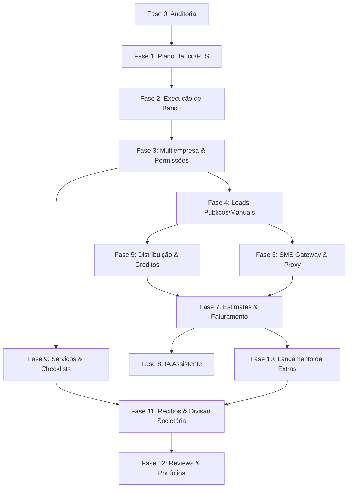

# Plano de Implementação Multiagente — HomeLeadPro SaaS Multiempresa

> **Nota de nomenclatura:** o produto anteriormente chamado Barrigudo passa a ter o nome comercial HomeLeadPro. Esta atualização altera apenas os documentos de planejamento, sem refatoração técnica no código.

---

## 1. Resumo da Estratégia
Para desenvolver uma plataforma SaaS multi-tenant complexa como o HomeLeadPro de forma ágil e segura, adotaremos uma **Estratégia de Desenvolvimento Distribuído com Isolamento de Escopo**. A equipe de inteligência artificial do Antigravity será estruturada em **8 agentes especializados**.

Para evitar conflitos de mesclagem (merge conflicts), regressões no código-fonte atual e concorrência na escrita de arquivos comuns, o desenvolvimento será rigidamente sequenciado através de um pipeline de entrega contínua. 
* **Fluxo de Trabalho Desacoplado:** Agentes de Frontend e de Banco de Dados trabalham em paralelo nas fases de modelagem conceitual (escrevendo arquivos locais de especificação).
* **Funil de Integração Sequencial:** No momento de modificar a base de código do Vite SPA, cada agente atua de forma exclusiva sob o controle e aprovação do Agente Coordenador (Arquiteto Técnico), garantindo que apenas um agente altere arquivos críticos de rotas, contextos e bibliotecas por vez.

---

## 2. Princípios Obrigatórios de Segurança
Durante a execução de todo o projeto, todos os agentes criados e o próprio usuário devem obedecer fielmente a estes pilares de segurança:
1. **Fases Incrementais Estritas:** Nenhuma fase deve acumular tarefas excessivas. Cada etapa deve focar em um conjunto isolado de recursos (ex: implementar SMS sem mexer em estimativas financeiras).
2. **Escopo Delimitado por Agente:** Cada agente opera apenas sob os diretórios e arquivos pré-autorizados para a sua tarefa. É proibida a alteração de arquivos de infraestrutura global por agentes de telas.
3. **Priorização do Banco e RLS:** Nenhuma tela administrativa ou lógica de negócio que trafegue dados sensíveis de clientes (como telefones ou orçamentos) pode ser construída antes que a tabela relacional correspondente esteja criada no banco e blindada com Row Level Security (RLS) testado.
4. **Geração Prévia de Migrations:** Toda alteração em banco de dados Supabase deve ser escrita primeiro em arquivos locais `.sql` legíveis por humanos para auditoria e aprovação do usuário. Nenhuma query SQL deve ser executada às cegas.
5. **Isolamento de Alterações Estéticas e Lógicas:** Refatorações visuais (melhorias em Tailwind, animações e glassmorphism) não devem ocorrer no mesmo commit de alterações de lógica de dados e APIs Supabase para facilitar a identificação de bugs.
6. **Ciclo de Fechamento de Fase:** Toda fase só é considerada concluída quando o build de produção passa com 100% de sucesso (`npm run build:vite`), a integridade TypeScript é validada e um relatório detalhado de arquivos modificados é submetido.

---

## 3. Agentes Recomendados

### Agente 1 — Arquiteto Técnico / Coordenador
* **Responsabilidade:** Orquestrador do projeto. Ele atua como o "portão de entrada" das tarefas. Ele detalha as fases, define a ordem exata de implementação das sub-tarefas, valida as dependências lógicas, inspeciona se o código produzido pelos outros agentes segue o [Documento Mestre do Produto](file:///c:/Desenvolvimento/SiteIhago/Site/documento_mestre_barrigudo.md) e resolve problemas de compatibilidade arquitetural.

### Agente 2 — Banco de Dados Supabase
* **Responsabilidade:** Modelagem lógica e física do banco. Ele planeja a estrutura das 28 tabelas sugeridas, chaves estrangeiras, constraints (ex: soma societária = 100%), chaves primárias UUID, índices de geolocalização e triggers automatizados (ex: alteração de status de lead). Ele entrega exclusivamente os scripts SQL revisáveis na pasta `/supabase`.

### Agente 3 — Segurança / RLS
* **Responsabilidade:** Garantia de blindagem e conformidade legal da plataforma. Ele escreve as políticas Row Level Security (RLS) do PostgreSQL, cria as regras de proteção multi-tenant baseadas nas relações de `organization_id` vinculadas ao `auth.uid()`, define as políticas públicas por token seguro para os clientes finais e projeta o fluxo de mascaramento/proteção de números telefônicos.

### Agente 4 — Frontend Público
* **Responsabilidade:** Interface e experiência de captação de clientes. Ele foca no site de marketing ([Index.tsx](file:///c:/Desenvolvimento/SiteIhago/Site/src/pages-spa/Index.tsx)), no formulário de leads progressivo ([Quote.tsx](file:///c:/Desenvolvimento/SiteIhago/Site/src/pages-spa/Quote.tsx)) com validação de geolocalização por ZIP, na página pública de estimates ([PublicView.tsx](file:///c:/Desenvolvimento/SiteIhago/Site/src/pages-spa/PublicView.tsx)), aceitação de extras e submissão de avaliações ([Experiences.tsx](file:///c:/Desenvolvimento/SiteIhago/Site/src/pages-spa/Experiences.tsx)).

### Agente 5 — Frontend Área da Empresa
* **Responsabilidade:** Desenvolvimento do CRM e Painel Gerencial do profissional. Suas telas compreendem o [Dashboard.tsx](file:///c:/Desenvolvimento/SiteIhago/Site/src/pages-spa/admin/Dashboard.tsx) da empresa, a caixa de entrada de leads qualificados, editor de estimates ([EstimateEditor.tsx](file:///c:/Desenvolvimento/SiteIhago/Site/src/pages-spa/admin/EstimateEditor.tsx)), painel de controle societário, checklist de tarefas operacionais, painel financeiro manual de conciliação de faturas e configurações de perfil ([CompanySettings.tsx](file:///c:/Desenvolvimento/SiteIhago/Site/src/pages-spa/admin/CompanySettings.tsx)).

### Agente 6 — Frontend Super Admin
* **Responsabilidade:** Interface administrativa central da plataforma SaaS. Desenvolve telas de acompanhamento de receita consolidada, controle e aprovação de novos cadastros de empresas parceiras, tela de ajuste e carregamento manual de créditos, regras de precificação de leads e logs gerais do sistema.

### Agente 7 — Integrações
* **Responsabilidade:** Comunicação e APIs externas. Ele implementa o gateway do Twilio SMS (envio de SMS pelo painel, recepção de webhooks de mensagens e injeção de logs no banco), integrações com as APIs de IA simples (sugestão de orçamentos e checklists via LLM por chat de texto), motor de compactação de fotos/vídeos antes do upload e exportação de PDFs estruturados no [pdf-generator.ts](file:///c:/Desenvolvimento/SiteIhago/Site/src/lib/pdf-generator.ts).

### Agente 8 — QA / Testes
* **Responsabilidade:** Garantia de qualidade e auditoria técnica. Ele cria checklists objetivos de testes de regressão, executa testes de invasão e vazamento multi-tenant (garantindo que a Empresa A não veja dados da Empresa B sob nenhuma circunstância HTTP), simula acessos de funcionários bloqueando telas financeiras, e valida a responsividade visual de telas mobile e desktop.

---

## 4. Fases de Implementação

### Fase 0 — Auditoria Rápida do Estado Atual
* **Objetivo:** Mapear a base atual de código sem modificar nenhum arquivo. Identificar todas as dependências instaladas, verificar o hibridismo entre Vite SPA e Next.js, certificar quais componentes visualmente prontos utilizam mocks estáticos, e elencar todos os arquivos de configuração do ecossistema.
* **Agentes Responsáveis:** Agente 1 (Arquiteto Coordenador).
* **Entrega:** Relatório detalhado listando a saúde dos componentes UI, mapeamento de arquivos chave que sofrerão intervenção e inventário de mocks ativos.

### Fase 1 — Plano de Banco e RLS em Arquivos Locais (Sem Aplicar)
* **Objetivo:** Estruturar toda a especificação de dados e segurança em formato escrito na raiz do projeto. Escrever as migrações SQL relativas a organizações, créditos, leads, estimates, checklists, sócios e reviews. Escrever as políticas de RLS e triggers de consistência societária.
* **Agentes Responsáveis:** Agente 2 (Banco de Dados) e Agente 3 (Segurança / RLS).
* **Entrega:** Arquivos `.sql` locais revisáveis na pasta `supabase/migrations/` e documentação detalhando o diagrama entidade-relacionamento.

### Fase 2 — Aplicação Controlada do Banco em Ambiente de Desenvolvimento
* **Objetivo:** Executar e homologar as migrações criadas no banco PostgreSQL de testes do Supabase. Habilitar as políticas RLS e criar buckets de Storage blindados para upload de recibos e mídias de vistoria.
* **Agentes Responsáveis:** Agente 2 (Banco de Dados), Agente 3 (Segurança / RLS) e Agente 8 (QA / Testes).
* **Entrega:** Banco de desenvolvimento estruturado, relatório de criação de schemas e validação automatizada de integridade das chaves estrangeiras.

### Fase 3 — Núcleo Multiempresa e Permissões
* **Objetivo:** Conectar a autenticação Supabase Auth à lógica multi-tenant no [UserContext.tsx](file:///c:/Desenvolvimento/SiteIhago/Site/src/context/UserContext.tsx). Tratar os papéis do sistema (super_admin, owner, admin, worker) garantindo que a proteção de rotas atue de acordo com o papel e a organização associada ao usuário autenticado.
* **Agentes Responsáveis:** Agente 1 (Arquiteto) e Agente 5 (Frontend Empresa).
* **Entrega:** Fluxo de login social integrado, redirecionamento com base em organização ativo, rotas restritas protegidas por middleware e telas de alteração do status ativo/inativo da empresa.

### Fase 4 — Leads Públicos e Manuais
* **Objetivo:** Conectar a coleta de leads do wizard público do site ([Quote.tsx](file:///c:/Desenvolvimento/SiteIhago/Site/src/pages-spa/Quote.tsx)) e do formulário manual do CRM às tabelas `leads` e `lead_files` do Supabase, incluindo o envio de mídias de vistoria associadas ao lead.
* **Agentes Responsáveis:** Agente 4 (Frontend Público) e Agente 7 (Integrações).
* **Entrega:** Leads qualificados salvos em banco remoto, upload de fotos anexas funcionando no Storage e listagem de leads no painel do administrador da empresa.

### Fase 5 — Distribuição Automática + Crédito Pré-Pago
* **Objetivo:** Implementar a lógica de matching regional de leads (ZIP code e raio de milhas configurados pela empresa) e regras de cobrança automática por leads distribuídos no backend. Bloquear o recebimento de contatos caso a empresa fique sem créditos pré-pagos.
* **Agentes Responsáveis:** Agente 2 (Banco de Dados), Agente 3 (Segurança / RLS) e Agente 6 (Frontend Super Admin).
* **Entrega:** Lead distribuído apenas para empresas ativas qualificadas, créditos debitados automaticamente do ledger financeiro e painel Super Admin gerenciando regras de preços.

### Fase 6 — SMS Intermediado
* **Objetivo:** Ligar as rotinas do Twilio SMS para interagir com o cliente final a partir da área privada. O sistema envia a mensagem como SMS mascarado e redireciona respostas recebidas em webhooks do Twilio para a tela de chat do painel da empresa correspondente.
* **Agentes Responsáveis:** Agente 7 (Integrações) e Agente 5 (Frontend Empresa).
* **Entrega:** Comunicação bidirecional via SMS ativa entre CRM e cliente final, sem exposição do número telefônico real do cliente.

### Fase 7 — Estimate + Link Público + Aprovação
* **Objetivo:** Implementar o fluxo de conversão de lead em proposta comercial no [EstimateEditor.tsx](file:///c:/Desenvolvimento/SiteIhago/Site/src/pages-spa/admin/EstimateEditor.tsx). O cliente final visualiza o orçamento a partir do token seguro, assina digitalmente online no celular e os métodos manuais de pagamento cadastrados são exibidos.
* **Agentes Responsáveis:** Agente 5 (Frontend Empresa), Agente 4 (Frontend Público) e Agente 7 (Integrações).
* **Entrega:** Propostas emitidas, link web público interativo em glassmorphism de visualização e fluxo de conciliação manual financeira ativo.

### Fase 8 — IA Simples
* **Objetivo:** Conectar APIs de IA por texto (Google Gemini API / OpenAI) para auxiliar a empresa a montar as descrições de estimates, insumos unitários, templates de mensagens e checklists operacionais a partir da entrada textual do lead.
* **Agentes Responsáveis:** Agente 7 (Integrações).
* **Entrega:** Chat do assistente de IA ativo no editor de faturas gerando rascunhos editáveis para revisão do profissional.

### Fase 9 — Serviços, Checklist, Funcionário e Arquivos
* **Objetivo:** Gerar a ordem de serviço (`service_job`) após o estimate ser aprovado. Atribuir o serviço a um funcionário de campo que acessa pelo smartphone apenas o checklist e tarefas de vistoria programados, registrando problemas e mídias de execução.
* **Agentes Responsáveis:** Agente 5 (Frontend Empresa) e Agente 8 (QA / Testes).
* **Entrega:** Controle de tarefas em tempo real, visualização exclusiva do funcionário limitada às suas atribuições e mídias do serviço armazenadas por visibilidade.

### Fase 10 — Extras Aprovados pelo Cliente
* **Objetivo:** Permitir o lançamento de serviços extras e materiais adicionais durante a execução da obra. O sistema gera uma cobrança complementar que é enviada via link por SMS para aprovação imediata do cliente antes do fechamento.
* **Agentes Responsáveis:** Agente 5 (Frontend Empresa) e Agente 4 (Frontend Público).
* **Entrega:** Faturamento reajustado com extras aprovados digitalmente pelo cliente e integrados de forma transparente ao total da fatura.

### Fase 11 — Recibos, Sócios e Financeiro Manual
* **Objetivo:** Inserir custos operacionais de materiais comprados em fornecedores. O sistema aplica o rateio de custos e lucros líquidos acumulados de acordo com os percentuais dos sócios configurados (validando a regra matemática obrigatória de 100%).
* **Agentes Responsáveis:** Agente 5 (Frontend Empresa) e Agente 2 (Banco de Dados).
* **Entrega:** Ledger de custos por serviço ativo, divisão de lucros entre sócios calculada e relatórios gerenciais societários consolidados.

### Fase 12 — Review e Portfólio Controlado
* **Objetivo:** Disparar solicitações automáticas de feedback via SMS após encerramento do serviço. Avaliações excelentes encaminham o cliente para o Google Review da empresa. As fotos finais podem ser moderadas pelo Super Admin para exibição no portfólio da Landing Page.
* **Agentes Responsáveis:** Agente 4 (Frontend Público) e Agente 6 (Frontend Super Admin).
* **Entrega:** Coleta de depoimentos ativa e atualização dinâmica da vitrine pública do site de captação.

---

## 5. Dependências entre Fases

O grafo abaixo ilustra a sequência lógica e técnica de liberação das fases:

* **RLS & Multiempresa antecedem os dados (Fase 2 e 3):** A proteção contra vazamento de informações fiscais ou leads sensíveis entre diferentes organizações SaaS precisa ser testada e garantida *antes* de expor e popular formulários do CRM.
* **Fase de Estimates (Fase 7) depende de SMS (Fase 6):** Para testar de forma real o envio de faturas e tokens seguros sem exigir logins de clientes, a infraestrutura de intermediação de SMS deve estar configurada e funcional.

---

## 6. Arquivos Prováveis por Área

Mapeamento dos componentes e arquivos chave do projeto atual que serão impactados por cada escopo:

* 📂 **Banco de Dados & RLS (`supabase/` ou root):**
  * Script de migração original: `supabase/remote_setup.sql` (caso exista).
  * Novas migrações: `supabase/migrations/*`.
* 📂 **Conectores & Bibliotecas Globais (`src/lib/`):**
  * Instanciação de clientes Supabase: [supabase.ts](file:///c:/Desenvolvimento/SiteIhago/Site/src/lib/supabase.ts).
  * Regras do CRM de Leads: [leads.ts](file:///c:/Desenvolvimento/SiteIhago/Site/src/lib/leads.ts).
  * Regras financeiras de Orçamentos: [estimates.ts](file:///c:/Desenvolvimento/SiteIhago/Site/src/lib/estimates.ts).
  * PDF profissional: [pdf-generator.ts](file:///c:/Desenvolvimento/SiteIhago/Site/src/lib/pdf-generator.ts).
* 📂 **Sessão & Estado (`src/context/`):**
  * Regras de Organização e Roles: [UserContext.tsx](file:///c:/Desenvolvimento/SiteIhago/Site/src/context/UserContext.tsx).
  * Traduções: [LanguageContext.tsx](file:///c:/Desenvolvimento/SiteIhago/Site/src/context/LanguageContext.tsx).
* 📂 **Visualizações & Páginas (`src/pages-spa/`):**
  * Landing page: [Index.tsx](file:///c:/Desenvolvimento/SiteIhago/Site/src/pages-spa/Index.tsx).
  * Wizard de leads: [Quote.tsx](file:///c:/Desenvolvimento/SiteIhago/Site/src/pages-spa/Quote.tsx).
  * Depoimentos públicos: [Experiences.tsx](file:///c:/Desenvolvimento/SiteIhago/Site/src/pages-spa/Experiences.tsx).
  * Painel Admin da Empresa: [Dashboard.tsx](file:///c:/Desenvolvimento/SiteIhago/Site/src/pages-spa/admin/Dashboard.tsx), [EstimateEditor.tsx](file:///c:/Desenvolvimento/SiteIhago/Site/src/pages-spa/admin/EstimateEditor.tsx) e [CompanySettings.tsx](file:///c:/Desenvolvimento/SiteIhago/Site/src/pages-spa/admin/CompanySettings.tsx).
* 📂 **Configuração Estática (`src/config/`):**
  * Cidades e ZIP codes de Massachusetts: [site.ts](file:///c:/Desenvolvimento/SiteIhago/Site/src/config/site.ts).

---

## 7. Riscos por Fase

A tabela abaixo descreve os riscos técnicos específicos e as ações mitigadoras de cada etapa:

| Fase | Risco Técnico Identificado | Impacto Operacional | Ação de Mitigação Planejada |
| :--- | :--- | :--- | :--- |
| **Fase 2** | Erros de sintaxe ou constraints de chave estrangeira quebradas. | Banco de dados inacessível ou falha catastrófica nas relações. | Executar scripts primeiramente em banco de testes descartável local antes de aplicar na nuvem. |
| **Fase 3** | Falhas na validação de papéis societários de RLS. | Uma empresa conseguindo ler leads e custos internos de outra empresa parceira. | Testes manuais e automatizados simulando tokens de diferentes organizações no Postman/Curl. |
| **Fase 5** | Concorrência e duplicidade de débito de créditos. | Empresa cobrada duas vezes pelo mesmo lead ou ficando com saldo negativo. | Lógica de transação atômica (`BEGIN TRANSACTION`) no PostgreSQL. |
| **Fase 6** | Falhas no envio de webhooks pelo Twilio. | Mensagens de SMS do cliente não aparecendo na tela de conversas do painel. | Configuração de filas de tentativas automáticas de webhook e monitoramento de logs. |
| **Fase 7** | Exposição acidental de margens de lucro ou custos de materiais. | Cliente visualizando quanto a empresa lucra no serviço residencial dele. | RLS protegendo tabelas internas de recibos e ocultação de campos do JSON no link público. |
| **Fase 9** | Upload de mídias de vistorias pesadas e estouro de storage. | Travamento de upload em campo e estouro de orçamento de armazenamento da nuvem. | Compactação obrigatória no client-side com verificação de tamanho máximo de payload (ex: 5MB). |
| **Fase 11** | Cadastro societário incompleto ou com soma incorreta de participações. | Erros matemáticos na partilha do lucro e dividendos parados na conta. | Função nativa no banco (Trigger/Constraint) que valida se a soma das porcentagens dos sócios fecha em 100%. |

---

## 8. Estratégia para Usar Múltiplos Agentes Sem Bagunçar

Para que o desenvolvimento com inteligência artificial ocorra de forma perfeitamente harmoniosa, seguiremos o protocolo abaixo:

1. **Agentes em Paralelo (Sem Conflitos):**
   * O **Agente 4 (Frontend Público)** e o **Agente 5 (Frontend Área da Empresa)** podem trabalhar simultaneamente, pois suas telas estão localizadas em pastas totalmente separadas do projeto (`src/pages-spa/` vs `src/pages-spa/admin/`).
   * O **Agente 2 (Banco de Dados)** pode escrever seus scripts SQL locais de tabelas de forma assíncrona ao desenvolvimento frontend de mockups.

2. **Bloqueio de Arquivos Comuns (Uso Exclusivo):**
   * Arquivos globais de contexto de login ([UserContext.tsx](file:///c:/Desenvolvimento/SiteIhago/Site/src/context/UserContext.tsx)), roteamento de rotas ([App.tsx](file:///c:/Desenvolvimento/SiteIhago/Site/src/App.tsx)) e conexão Supabase ([supabase.ts](file:///c:/Desenvolvimento/SiteIhago/Site/src/lib/supabase.ts)) **NÃO podem** ser modificados por mais de um agente ao mesmo tempo.
   * O **Agente 1 (Coordenador)** deve pausar os outros agentes e atribuir a tarefa de alteração desses arquivos globais a um único agente por vez, testando a compilação imediatamente.

3. **Protocolo de Integração Segura:**
   * **Revisão de Diffs:** Antes de fazer merge ou atualizar o arquivo principal da base, o código gerado deve ser revisado em formato Markdown de diff pelo Agente Coordenador.
   * **Validação de Build:** Toda alteração exige execução do comando `npm run build:vite` localmente. Se o build quebrar, a alteração é revertida imediatamente.

---

## 9. Critérios de Aceite por Fase
* [ ] **Compilação sem Erros:** O comando de build (`npm run build:vite`) é executado sem nenhum alerta do compilador TypeScript ou Vite.
* [ ] **Auditoria de Console Limpa:** O console do desenvolvedor no navegador não apresenta erros de conexão de banco de dados ou chamadas REST 404/500 nas rotas testadas.
* [ ] **Blindagem Tenant Validada:** Ao tentar executar uma query SQL direta usando a chave pública e o token da Empresa A, nenhuma informação da Empresa B é retornada.
* [ ] **Controle Financeiro Estrito:** Não é permitido salvar uma estimativa societária cujas cotas societárias somem 99% ou 101%. O ledger de créditos nunca permite débitos que excedam o saldo disponível da empresa.
* [ ] **Acesso do Funcionário Bloqueado:** Ao logar com perfil de trabalhador de campo, qualquer requisição ou visualização de valores monetários, orçamentos totais e rateios de dividendos societários é bloqueada na tela e na API.

---

## 10. Primeira Tarefa Real Recomendada
A primeira tarefa técnica real após a aprovação deste plano é a **Fase 0 (Auditoria Rápida do Estado Atual)**. 

O Agente Coordenador deve realizar a análise da raiz do projeto, mapeando se a compilação do Vite SPA hoje é estável sem o suporte do Express local, confirmando a pasta exata contendo os componentes visuais que utilizam dados fictícios (mocks) e gerando o relatório técnico pré-implementação sem realizar nenhuma modificação no código-fonte.

---

## 11. Entrega Final
Este plano multiagente foi consolidado com sucesso e está pronto para servir como mapa estratégico do projeto. Ele divide as responsabilidades em 13 fases seguras (Fase 0 a 12), organiza os 8 agentes por escopo e garante critérios rígidos de RLS, multi-tenant e segurança em Massachusetts, evitando bugs e conflitos na base atual.

---

“Nenhuma alteração técnica foi feita. Apenas os documentos de planejamento foram atualizados para o nome comercial HomeLeadPro.”
