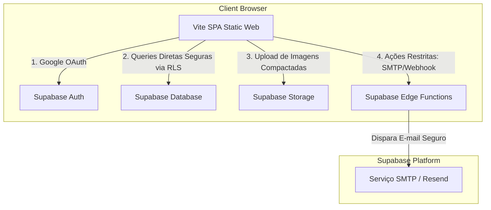

# 🗺️ Plano de Planejamento Técnico & Estratégico — Projeto Barrigudo

> **Status:** 🟢 Finalizado e Pronto para Discussão  
> **Papel:** Arquiteto de Software Full-Stack Sênior  
> **Data:** 18 de Maio de 2026  
> **Escopo:** Planejamento Estratégico, Decisão Arquitetural, RLS e Banco de Dados  

---

## 1. 🏛️ Decisão de Arquitetura Recomendada

Para guiar o projeto **Barrigudo** em direção a um ambiente de produção escalável e de fácil manutenção, avaliamos cinco caminhos possíveis. A seguir, apresentamos a análise detalhada de cada cenário técnico.

---

### Opção A — Manter como React + Vite SPA
Esta opção mantém o ecossistema puramente como uma Single Page Application rodando sobre o Vite, empacotando todo o código estático para ser servido por uma CDN.

*   **Vantagens:**
    *   **Velocidade de HMR:** Desenvolvimento extremamente rápido proporcionado pelo Vite.
    *   **Simplicidade de Hospedagem:** A SPA compilada pode ser implantada gratuitamente ou a custo baixíssimo em CDNs globais (como Netlify, Vercel, Cloudflare Pages).
    *   **Acoplamento Mínimo:** Separação total de preocupações entre interface gráfica e APIs de backend.
*   **Desvantagens:**
    *   **Desempenho de SEO:** Como o conteúdo é injetado dinamicamente via client-side JavaScript, crawlers de busca mais simples podem ter dificuldades na indexação (embora resolúvel para páginas de marketing usando pré-renderização).
    *   **Segurança de Chaves:** Toda a lógica roda no navegador do usuário, impossibilitando a execução de segredos de API privados (como tokens de SMTP corporativos) sem um servidor intermediário.
*   **Riscos:** Baixo risco de quebra de código atual, visto que a SPA em Vite já é o motor principal que renderiza o painel hoje.
*   **Complexidade:** Baixa. É o fluxo natural de evolução do protótipo atual.
*   **Custo de Manutenção:** Baixíssimo. CDNs estáticas exigem manutenção de infraestrutura nula.
*   **Melhor Cenário de Uso:** Aplicações do tipo Dashboard de CRM fechado onde SEO não é prioritário e a agilidade de entrega do MVP é crucial.
*   **Pior Cenário de Uso:** Portais públicos complexos que dependem fortemente de compartilhamento em redes sociais com metadados dinâmicos (Open Graph dinâmico por página).
*   **Veredito para o Barrigudo:** **Muito Viável**, porém incompleto por si só, pois páginas públicas de cotação necessitam de chamadas seguras (como checagem de geolocalização e disparo de e-mails) que necessitam de um backend.

---

### Opção B — Migrar Totalmente para Next.js
Reconstruir a aplicação sob a arquitetura do Next.js (App Router), movendo os componentes das páginas SPA para o diretório `src/app` e utilizando Server Components.

*   **Vantagens:**
    *   **SEO de Ponta a Ponta:** SSR (Server-Side Rendering) nativo permite tempo de carregamento inicial excelente e indexação perfeita pelo Google.
    *   **Rotas de API Embutidas:** Possibilidade de criar rotas serverless sob o mesmo projeto (eliminando servidores Express apartados).
    *   **Otimização de Recursos:** Carregamento inteligente de imagens e fontes integrados de fábrica.
*   **Desvantagens:**
    *   **Curva de Aprendizado:** O App Router do Next.js 15 exige entendimento aprofundado de Server vs. Client Components.
    *   **Esforço de Migração Massivo:** Quase todas as páginas SPA ativas usam ganchos de `react-router-dom` (como `useNavigate` e `useParams`) que precisariam ser reescritos para o roteamento do Next.js (`next/navigation`).
*   **Riscos:** Alto risco de regressão visual e funcional de rotas de formulários durante a migração.
*   **Complexidade:** Altíssima.
*   **Custo de Manutenção:** Médio. Hospedagem serverless (como Vercel) escala custos conforme tráfego e computação de funções de borda.
*   **Melhor Cenário de Uso:** Grandes portais de e-commerce e diretórios públicos corporativos onde a indexação de milhares de páginas dinâmicas no Google é o coração da aquisição de usuários.
*   **Pior Cenário de Uso:** Dashboards puramente operacionais de CRM internos que poderiam rodar de forma simples e rápida do lado do cliente.
*   **Veredito para o Barrigudo:** **Inviável para o MVP atual**. O tempo e risco para reescrever toda a navegação e componentes Shadcn/Vite para Next.js atrasariam severamente o lançamento.

---

### Opção C — Manter Vite no Frontend e Express Separado no Backend
Manter o front em Vite e o backend customizado em Express rodando em servidores separados em produção.

*   **Vantagens:**
    *   **Desacoplamento de Equipes:** Desenvolvedores de frontend e backend trabalham em repositórios e pipelines independentes.
    *   **Flexibilidade Operacional:** O Express pode rodar processos contínuos (como websockets contínuos ou filas de tarefas pesadas).
*   **Desvantagens:**
    *   **Latência Aumentada:** Requisições precisam cruzar domínios de servidores diferentes na rede.
    *   **Gerenciamento CORS:** Alta probabilidade de erros de configuração de cabeçalhos e cookies cross-domain.
    *   **Complexidade de Deploy Duplo:** Dois servidores independentes para monitorar, escalar e pagar.
*   **Riscos:** Médio. Dificuldade de manter sessões síncronas entre plataformas.
*   **Complexidade:** Média.
*   **Custo de Manutenção:** Alto. Requer gerenciamento de servidores VPS (como Render, AWS, Heroku) para manter o Express sempre online.
*   **Melhor Cenário de Uso:** Aplicações empresariais de larga escala com equipes de desenvolvimento dedicadas a microsserviços.
*   **Pior Cenário de Uso:** Startups pequenas ou projetos solo com poucos desenvolvedores que precisam de agilidade e baixo custo operacional.
*   **Veredito para o Barrigudo:** **Não recomendado**. O Express atual possui pouquíssima lógica de negócios (apenas proxy de configurações e portfólio de arquivos locais), não justificando o custo de infraestrutura contínua em produção.

---

### Opção D — Remover Express e Centralizar Tudo no Supabase
**A ARQUITETURA RECOMENDADA.** Consiste em desativar e remover o servidor Express, hospedar o frontend puramente como uma SPA em Vite de baixíssimo custo e altíssima performance, e delegar 100% da inteligência de dados, autenticação, armazenamento e fluxos seguros às **Edge Functions do Supabase**.



*   **Vantagens:**
    *   **Custo Próximo de Zero:** Hospedagem estática da SPA (Vite) é gratuita (Vercel/Netlify), e o Supabase possui plano gratuito extremamente robusto para banco, auth e storage.
    *   **Segurança Máxima:** Todas as validações financeiras e segredos de e-mail rodam dentro do ambiente isolado e seguro das Edge Functions (Deno runtime).
    *   **Unidade de Dados:** Elimina o conflito de salvar logs/portfólio em arquivos locais JSON, unificando tudo em tabelas PostgreSQL relacionais reais.
    *   **Simplicidade de Build:** Apenas um projeto estático frontend para compilar e fazer deploy.
*   **Desvantagens:**
    *   **Ambiente Isolado:** Lógicas serverless de Edge Functions operam em formato *Stateless* (sem estado na memória RAM persistente), necessitando que toda chamada busque informações em banco de dados ou caches (Redis).
*   **Riscos:** Baixíssimo. O frontend do Barrigudo já está 85% acoplado e pronto para consumir o Supabase diretamente.
*   **Complexidade:** Baixa-Média.
*   **Custo de Manutenção:** Mínimo. Sem servidores dedicados 24/7 para monitorar.
*   **Melhor Cenário de Uso:** MVPs rápidos, SaaS modernos e aplicações de alta escala orientadas a eventos de baixo custo.
*   **Pior Cenário de Uso:** Aplicações legadas que exigem execução contínua de processamento pesado em background (renderização de vídeo pesado 24/7 ou servidores de jogos).
*   **Veredito para o Barrigudo:** **ALTAMENTE RECOMENDADA.** É a escolha ideal. Ela simplifica radicalmente a base de código híbrida, unifica os dados no PostgreSQL remoto e garante a segurança do produto através de políticas RLS nativas, mantendo o excelente design do Vite intocado.

---

## 2. 🛡️ O Que Deve Ser Preservado

O projeto já possui ativos de software extremamente valiosos que **não devem ser alterados visualmente ou funcionalmente**, apenas mantidos estáveis durante a transição da arquitetura de backend.

| Recurso | Motivo da Preservação | Arquivos Principais | Cuidado na Evolução para Não Quebrar |
| :--- | :--- | :--- | :--- |
| **Design Visual & UI** | Paleta premium `#0b2a4a` com glassmorphism de altíssimo nível. | [index.css](file:///c:/Desenvolvimento/SiteIhago/Site/src/index.css), `src/components/*` | Preservar as variáveis Tailwind no [index.css](file:///c:/Desenvolvimento/SiteIhago/Site/src/index.css). |
| **Wizard de Orçamento** | Formulário dinâmico, progresso em barra e busca por Zip Code autônoma. | [Quote.tsx](file:///c:/Desenvolvimento/SiteIhago/Site/src/pages-spa/Quote.tsx) | Não alterar a estrutura do formulário Zod ou chamada da API Zippopotam.us. |
| **Geração de PDF** | Desenho vetorizado do orçamento perfeitamente alinhado com jsPDF. | [pdf-generator.ts](file:///c:/Desenvolvimento/SiteIhago/Site/src/lib/pdf-generator.ts) | Manter os parâmetros e a assinatura da função `generateProfessionalPDF`. |
| **i18n (Traduções)** | Sistema de internacionalização consolidado para múltiplos idiomas. | [LanguageContext.tsx](file:///c:/Desenvolvimento/SiteIhago/Site/src/context/LanguageContext.tsx) | Não alterar os arquivos JSON de dicionários no diretório de traduções. |
| **Visualizador Público** | Tela pública limpa de faturamento para o cliente aprovar o orçamento. | [PublicView.tsx](file:///c:/Desenvolvimento/SiteIhago/Site/src/pages-spa/PublicView.tsx) | Preservar o parâmetro dinâmico da rota `/estimate/view/:token`. |
| **Editor de Orçamentos** | Tela rica de precificação, tributos e descontos automáticos. | [EstimateEditor.tsx](file:///c:/Desenvolvimento/SiteIhago/Site/src/pages-spa/admin/EstimateEditor.tsx) | Manter os cálculos matemáticos de subtotal e saldo intactos. |
| **Configuração de Empresa**| Gestão de logos e termos legais de serviço. | [CompanySettings.tsx](file:///c:/Desenvolvimento/SiteIhago/Site/src/pages-spa/admin/CompanySettings.tsx) | Preservar os campos de formulário e a integração com Supabase Storage. |

---

## 3. 🗑️ O Que Deve Ser Removido ou Substituído

Esta etapa visa expurgar códigos duplicados, arquivos mortos e inconsistências para trazer o projeto a um nível de excelência.

### 1. Servidor Node/Express de Desenvolvimento
*   **O que é:** O servidor Express local localizado em `server/index.js` que simula login e atua como API local.
*   **Por que é problema:** Duplica o ecossistema. Mantém dados de login-attempts e portfólio em arquivos locais JSON que seriam perdidos em deploy serverless.
*   **Melhor substituição:** Desativar a inicialização do Express em produção e migrar todas as suas tabelas para o Supabase PostgreSQL.

### 2. Configurações e Diretórios Híbridos de Next.js
*   **O que é:** Arquivos como `next.config.mjs`, `next-env.d.ts`, `vercel.json` e a pasta `src/app`.
*   **Por que é problema:** Causa extrema confusão arquitetural ao empacotador. O projeto compila e roda primariamente como uma SPA em Vite (`vite.config.ts.bak`). Ter configurações de dois frameworks conflitantes atrasa a identificação de erros de compilação.
*   **Melhor substituição:** Isolar a pasta `src/app` e os arquivos Next.js em um diretório de backup (`_next_backup/`) e focar estritamente nas rotas SPA de `src/pages-spa` configuradas no [App.tsx](file:///c:/Desenvolvimento/SiteIhago/Site/src/App.tsx).

### 3. Persistência de Portfólio Local em Arquivos JSON
*   **O que é:** Arquivos de banco JSON armazenados no servidor Express (`data/portfolio.json`).
*   **Por que é problema:** Dificulta a edição dinâmica do portfólio em ambiente multi-empresa. Dados locais são estáticos e de difícil escalabilidade.
*   **Melhor substituição:** Tabelas `portfolio_items` e `portfolio_categories` reais no Supabase ligadas a buckets do Storage para as imagens.

### 4. Mocks de Logs de Tentativa de Login
*   **O que é:** A função [fetchLoginAttempts](file:///c:/Desenvolvimento/SiteIhago/Site/src/lib/admin-auth.ts#L54-L58) que retorna array vazio na SPA.
*   **Por que é problema:** Deixa o painel do dashboard sem a telemetria necessária de auditoria de invasões.
*   **Melhor substituição:** Tabela `login_attempts` no Supabase preenchida via Trigger de autenticação ou interceptor no frontend.

---

## 4. 🗄️ Plano de Banco de Dados Supabase (PostgreSQL)

Para unificar o armazenamento e prover persistência robusta, propomos a modelagem lógica a seguir. As migrações devem ser implementadas sequencialmente sem perdas.

### 1. Tabela: `organizations` (Multi-Tenant Core)
*   `id`: `uuid` (Primary Key, default: `gen_random_uuid()`)
*   `name`: `text` (Not Null)
*   `slug`: `text` (Unique, Not Null)
*   `created_at`: `timestamptz` (default: `now()`)

### 2. Tabela: `organization_users` (Associação e Papéis)
*   `id`: `uuid` (Primary Key, default: `gen_random_uuid()`)
*   `user_id`: `uuid` (References `auth.users`, on delete cascade)
*   `organization_id`: `uuid` (References `organizations`, on delete cascade)
*   `role`: `text` (Check constraint: `'owner'`, `'admin'`, `'staff'`)
*   `created_at`: `timestamptz` (default: `now()`)

### 3. Tabela: `leads` (Captação Pública)
*   `id`: `uuid` (Primary Key, default: `gen_random_uuid()`)
*   `organization_id`: `uuid` (References `organizations`, on delete cascade)
*   `full_name`: `text` (Not Null)
*   `email`: `text` (Not Null)
*   `phone`: `text` (Not Null)
*   `zip`: `text` (Not Null)
*   `city`: `text`
*   `state`: `text`
*   `selected_service_option`: `text` (Not Null)
*   `details`: `text`
*   `status`: `text` (default: `'New'`, Check constraint: `'New'`, `'Contacted'`, `'Approved'`, `'Rejected'`)
*   `created_at`: `timestamptz` (default: `now()`)

### 4. Tabela: `lead_files` (Imagens anexadas ao Lead pelo wizard)
*   `id`: `uuid` (Primary Key, default: `gen_random_uuid()`)
*   `lead_id`: `uuid` (References `leads`, on delete cascade)
*   `file_url`: `text` (Not Null)
*   `created_at`: `timestamptz` (default: `now()`)

### 5. Tabela: `estimates` (Cabeçalho de Orçamento)
*   `id`: `uuid` (Primary Key, default: `gen_random_uuid()`)
*   `organization_id`: `uuid` (References `organizations`, on delete cascade)
*   `lead_id`: `uuid` (References `leads`, on delete set null)
*   `client_name`: `text` (Not Null)
*   `client_email`: `text`
*   `client_phone`: `text`
*   `client_address`: `text`
*   `client_city`: `text`
*   `client_state`: `text`
*   `client_zip`: `text`
*   `status`: `text` (default: `'Draft'`, Check constraint: `'Draft'`, `'Sent'`, `'Viewed'`, `'Approved'`, `'Rejected'`, `'Paid'`, `'Partially_Paid'`)
*   `subtotal`: `numeric` (Not Null, default: `0`)
*   `tax_rate`: `numeric` (Not Null, default: `0`)
*   `tax_amount`: `numeric` (Not Null, default: `0`)
*   `discount_amount`: `numeric` (Not Null, default: `0`)
*   `total_amount`: `numeric` (Not Null, default: `0`)
*   `amount_paid`: `numeric` (Not Null, default: `0`)
*   `balance_due`: `numeric` (Not Null, default: `0`)
*   `payment_status`: `text` (default: `'unpaid'`, Check constraint: `'unpaid'`, `'partially_paid'`, `'paid'`)
*   `public_token`: `text` (Unique, Not Null, default: dynamic hash)
*   `notes`: `text`
*   `terms`: `text`
*   `valid_until`: `timestamptz`
*   `approved_at`: `timestamptz`
*   `created_at`: `timestamptz` (default: `now()`)

### 6. Tabela: `estimate_items` (Linhas de Itens do Orçamento)
*   `id`: `uuid` (Primary Key, default: `gen_random_uuid()`)
*   `estimate_id`: `uuid` (References `estimates`, on delete cascade)
*   `organization_id`: `uuid` (References `organizations`, on delete cascade)
*   `description`: `text` (Not Null)
*   `quantity`: `numeric` (Not Null, default: `1`)
*   `unit_price`: `numeric` (Not Null, default: `0`)
*   `total_price`: `numeric` (Not Null, default: `0`)
*   `created_at`: `timestamptz` (default: `now()`)

### 7. Tabela: `estimate_payments` (Registro de Quitação de Faturas)
*   `id`: `uuid` (Primary Key, default: `gen_random_uuid()`)
*   `organization_id`: `uuid` (References `organizations`, on delete cascade)
*   `estimate_id`: `uuid` (References `estimates`, on delete cascade)
*   `amount`: `numeric` (Not Null)
*   `payment_method`: `text` (Check constraint: `'cash'`, `'card'`, `'check'`, `'pix'`, `'transfer'`)
*   `payment_date`: `timestamptz` (default: `now()`)
*   `created_at`: `timestamptz` (default: `now()`)

### 8. Tabela: `reviews` (Feedback de Clientes)
*   `id`: `uuid` (Primary Key, default: `gen_random_uuid()`)
*   `user_id`: `uuid` (References `auth.users`, on delete cascade)
*   `user_name`: `text` (Not Null)
*   `user_avatar_url`: `text`
*   `rating`: `integer` (Check constraint: `rating between 1 and 5`)
*   `body`: `text` (Not Null)
*   `is_hidden`: `boolean` (default: `false`)
*   `created_at`: `timestamptz` (default: `now()`)

### 9. Tabela: `portfolio_items` (Itens do Portfólio no Supabase)
*   `id`: `text` (Primary Key, slug descritivo)
*   `title`: `text` (Not Null)
*   `category`: `text` (Not Null)
*   `cover_image`: `text` (Not Null)
*   `images`: `text[]` (Array de strings para galeria)
*   `tags`: `text[]`
*   `description`: `text`
*   `scope`: `text`
*   `featured`: `boolean` (default: `false`)
*   `created_at`: `timestamptz` (default: `now()`)

### 10. Tabela: `company_settings` (Variáveis Legais e Fiscais de Invoicing)
*   `organization_id`: `uuid` (Primary Key, References `organizations`, on delete cascade)
*   `company_name`: `text` (Not Null)
*   `logo_url`: `text`
*   `phone`: `text`
*   `email`: `text`
*   `address`: `text`
*   `license_number`: `text`
*   `insurance_info`: `text`
*   `default_tax_rate`: `numeric` (default: `0`)
*   `default_footer`: `text`
*   `default_terms`: `text`

### 11. Tabela: `login_attempts` (Telemetria de Auditoria de Acesso)
*   `id`: `uuid` (Primary Key, default: `gen_random_uuid()`)
*   `timestamp`: `timestamptz` (default: `now()`)
*   `email`: `text` (Not Null)
*   `ip`: `text`
*   `user_agent`: `text`
*   `outcome`: `text` (Check constraint: `'success'`, `'fail'`)
*   `reason`: `text`

---

## 5. 🔒 Plano de RLS (Row Level Security) e Segurança

Abaixo, detalhamos a matriz de regras de segurança no Supabase para impedir o acesso a dados de outras empresas ou manipulações maliciosas.

### Matriz de Controle de Políticas RLS:

| Tabela | RLS | Select (Leitura) | Insert (Escrita) | Update (Atualização) | Delete (Remoção) | Filtro por Role/ID |
| :--- | :---: | :--- | :--- | :--- | :--- | :--- |
| `organizations` | **ON** | Apenas usuários associados na tabela `organization_users`. | Apenas via **Service Role** do backend no cadastro do SaaS. | Apenas proprietário (`role = 'owner'`). | Bloqueado. | `id IN (select organization_id from organization_users where user_id = auth.uid())` |
| `organization_users` | **ON** | Usuários da mesma organização. | Apenas proprietário (`role = 'owner'`). | Apenas proprietário (`role = 'owner'`). | Proprietário (`role = 'owner'`). | `organization_id IN (select organization_id from organization_users where user_id = auth.uid())` |
| `leads` | **ON** | Autenticados da organização correspondente. | **Público (Anon):** Permissão de envio livre. | Autenticados da mesma organização. | Apenas proprietários ou administradores. | *Leitura:* `organization_id IN (...)`<br>*Escrita:* Livre sem leitura. |
| `lead_files` | **ON** | Autenticados da organização correspondente. | **Público (Anon):** Apenas envio sem consulta. | Autenticados da mesma organização. | Autenticados da mesma organização. | Protege imagens de orçamentos e vistorias privadas. |
| `estimates` | **ON** | 1. Autenticados da org.<br>2. **Público por token:** Via cláusula `public_token = token`. | Autenticados da mesma organização. | Autenticados da mesma organização. | Bloqueado (mudar status para 'Archived' ou 'Rejected'). | `organization_id IN (select organization_id from organization_users where user_id = auth.uid()) OR public_token = current_token` |
| `estimate_items` | **ON** | Autenticados da org e clientes com token válido. | Autenticados da mesma organização. | Autenticados da mesma organização. | Autenticados da mesma organização. | Relacionado à segurança da fatura pai. |
| `estimate_payments` | **ON** | Apenas autenticados da organização correspondente. | Apenas autenticados da organização correspondente. | Apenas proprietários ou administradores. | Bloqueado (conciliação não deve ser apagada). | Controle financeiro estrito. |
| `reviews` | **ON** | **Público (Anon):** Se `is_hidden = false`. | Apenas usuários autenticados via Google OAuth. | Apenas o próprio autor (`user_id = auth.uid()`). | Apenas o próprio autor. | Evita spam e manipulação de avaliações alheias. |
| `portfolio_items` | **ON** | **Público (Anon):** Livre para navegação no site. | Apenas autenticados (qualquer papel de equipe). | Apenas autenticados. | Apenas autenticados. | Facilita a manutenção do catálogo da empresa. |
| `company_settings` | **ON** | **Público por token:** Para renderizar no visualizador da fatura.<br>2. Autenticados da org. | Apenas proprietário da organização. | Apenas proprietário da organização. | Bloqueado. | Proteção de dados fiscais e de branding corporativos. |
| `login_attempts` | **ON** | Apenas administradores e proprietários. | **Público (Anon):** Permitido inserir no fluxo de tentativa de login. | Bloqueado. | Bloqueado. | Registro imutável de telemetria de invasão. |

---

## 6. 🔄 Fluxo Ideal do Produto (End-to-End Pipeline)

O mapeamento dos fluxos essenciais de negócios liga as interfaces aos modelos físicos de dados.

### 🌊 1. Fluxo de Captação Pública (Lead Pipeline)

```
[Visitante Acessa Landing Page]
     │ (pages-spa/Index.tsx)
     ▼
[Navega pelo Portfólio Estiloso & Reviews Reais]
     │ (Consome tables: portfolio_items, reviews)
     ▼
[Inicia Wizard de Orçamento Progressivo]
     │ (pages-spa/Quote.tsx)
     ▼
[Digita ZIP -> Preenche dados -> Anexa fotos da fachada]
     │ (Insere em: leads, lead_files & envia imagem para o Storage: 'images')
     ▼
[Recebe Confirmação Amigável de Sucesso]
     │ (pages-spa/Success.tsx)
     ▼
[Lead é notificado na tela administrativa do Admin]
       (Exibe notificação em tempo real via Supabase Realtime)
```

*   **Páginas Participantes:** `Index.tsx`, `Quote.tsx`, `Success.tsx`.
*   **Tabelas Participantes:** `portfolio_items`, `reviews`, `leads`, `lead_files`.
*   **Riscos Operacionais:** Falha no lookup do Zip Code por indisponibilidade temporária de rede da API Zippopotam.us. **Solução:** Campo manual de fallback de texto para Cidade/Estado caso a API falhe.

---

### 💼 2. Fluxo Administrativo (CRM & Invoicing Pipeline)

```
[Administrador Efetua Login via Google OAuth]
     │ (pages-spa/admin/AdminLogin.tsx)
     ▼
[Acessa Leads Recentes no CRM e seleciona o lead do cliente]
     │ (pages-spa/admin/Inbox.tsx -> LeadDetail.tsx)
     ▼
[Cria novo Orçamento a partir dos dados do Lead]
     │ (Gera registro em: estimates contendo dados de contato pré-preenchidos)
     ▼
[Adiciona Itens de Serviço, Define Margens, Impostos e Descontos]
     │ (pages-spa/admin/EstimateEditor.tsx -> Insere em: estimate_items)
     ▼
[Gera PDF Dinamicamente e Atualiza Status do Orçamento para 'Sent']
     │ (Usa: pdf-generator.ts -> Envia link por e-mail ou copia public_token)
     ▼
[Cliente abre o link público seguro em formato Glassmorphism]
     │ (pages-spa/PublicView.tsx -> Status muda para 'Viewed')
     ▼
[Cliente clica em "Approve Estimate" -> Aceita termos de serviço]
     │ (Muda status em: estimates para 'Approved' com registro de data/hora)
     ▼
[Admin concilia entrada financeira no painel administrativo]
       (Registra na tabela: estimate_payments -> Saldo do orçamento atualiza automaticamente)
```

*   **Páginas Participantes:** `AdminLogin.tsx`, `Inbox.tsx`, `LeadDetail.tsx`, `EstimateEditor.tsx`, `PublicView.tsx`.
*   **Tabelas Participantes:** `estimates`, `estimate_items`, `estimate_payments`, `company_settings`, `login_attempts`.
*   **Gaps Identificados:** O envio real de e-mails de notificação ao cliente contendo o link da fatura hoje está simulado. **Solução:** Integrar disparador robusto nas Edge Functions na próxima fase.

---

## 7. 🛠️ Funcionalidades que Faltam para Virar Produto Real

Estruturamos as pendências funcionais do projeto em ordem de prioridade de entrega mercadológica.

### 🟢 Essencial para o MVP (Lançamento Seguro)
1.  **Segurança Remota Real:** Escrita e execução da migração DDL de criação de tabelas e habilitação do RLS no banco de dados Supabase de produção.
2.  **Unidade Arquitetural (Descarte do Express):** Migração das configurações e tabelas do Express para rodarem diretamente do lado do cliente e em Edge Functions.
3.  **Fluxo de Portfólio Dinâmico:** Painel operacional no admin para o proprietário subir novas fotos de serviços e cadastrar categorias direto no banco de dados.
4.  **Sistema Real de Notificação por E-mail:** Canal seguro enviando o link com o token do orçamento aprovado para o cliente e informando o administrador sobre novos leads.

### 🟡 Importante pós-MVP (Escalabilidade & SaaS)
1.  **Integração com Gateway de Pagamento:** Conectar a conciliação de faturas via PIX, Stripe ou Cartão de Crédito, automatizando a baixa dos orçamentos aprovados.
2.  **Painel Avançado de Métricas:** Gráficos interativos extras no dashboard detalhando lucros por categoria de serviço prestado.
3.  **Recuperação Inteligente de Rascunhos:** Caso o visitante saia no meio do preenchimento do formulário wizard de cotação, os dados prévios são guardados no localStorage para evitar retrabalho.

### 🔵 Premium & Visão de Futuro (Diferenciais Competitivos)
1.  **Precificação Inteligente por Inteligência Artificial:** Integração com APIs LLM (usando bibliotecas como `@google/genai` herdadas do ecossistema CalhaFlow) para ler imagens de danos residenciais submetidas pelo cliente e sugerir estimativa de preços de serviços para o administrador de forma instantânea.
2.  **Painel Multi-Empresa Avançado (White Label):** Possibilidade de novas empresas contratarem o sistema "Barrigudo" e usarem com sua própria logomarca e domínio personalizado.

---

## 8. 🚀 Plano de Execução em Fases

Este plano de 12 fases define o trajeto seguro do projeto do estado atual ao deploy definitivo em produção.

---

### FASE 0 — Backup e Diagnóstico Final
*   **Objetivo:** Preservar o estado original da base de código e documentar variáveis de ambiente.
*   **Arquivos Prováveis:** Toda a raiz do projeto.
*   **Tabelas Envolvidas:** Nenhuma.
*   **O que deve ser feito:** Criar uma cópia compactada completa do projeto em diretório seguro e listar as portas e chaves ativas no arquivo `.env`.
*   **O que NÃO deve ser feito:** Alterar ou deletar qualquer código-fonte.
*   **Riscos:** Inexistente.
*   **Como testar:** Garantir que o backup comprimido abre perfeitamente.
*   **Critério de Sucesso:** Cópia de segurança criada com sucesso.

---

### FASE 1 — Escolha e Limpeza da Arquitetura
*   **Objetivo:** Remover as ambiguidades de frameworks unificando o empacotamento estrito para Vite SPA.
*   **Arquivos Prováveis:** `package.json`, `next.config.mjs`, `vercel.json`, `src/app`.
*   **Tabelas Envolvidas:** Nenhuma.
*   **O que deve ser feito:** Isolar arquivos do Next.js e o servidor Express em pastas de backup (`_backup_next/`, `_backup_express/`) e configurar scripts do `package.json` focando exclusivamente no build Vite (`vite build`).
*   **O que NÃO deve ser feito:** Modificar componentes de estilo da UI.
*   **Riscos:** Quebra acidental de imports globais de aliases (`@/*`).
*   **Como testar:** Rodar `npm run build:vite` localmente e validar se a compilação estática do SPA ocorre sem erros de tipagem TypeScript.
*   **Critério de Sucesso:** Build completo do SPA gerado sem erros de compilação em menos de 30 segundos.

---

### FASE 2 — Banco Supabase e Migrations
*   **Objetivo:** Criar e disponibilizar a estrutura relacional do banco de dados na nuvem.
*   **Arquivos Prováveis:** Arquivos de scripts SQL na pasta `supabase/`.
*   **Tabelas Envolvidas:** Todas as 11 tabelas propostas no plano de banco.
*   **O que deve ser feito:** Escrever a estrutura de tabelas utilizando tipos e constraints adequados (UUIDs, numéricos monetários e chaves estrangeiras apropriadas).
*   **O que NÃO deve ser feito:** Adicionar comandos destrutivos sem backup em bancos de dados de produção ativos.
*   **Riscos:** Incompatibilidade de tipos UUID e relações órfãs no seed.
*   **Como testar:** Executar o script SQL no painel de consultas do Supabase e conferir se as colunas refletem os esquemas corretos.
*   **Critério de Sucesso:** Todas as tabelas criadas no banco PostgreSQL remoto sem alertas de sintaxe.

---

### FASE 3 — RLS e Segurança
*   **Objetivo:** Proteger os acessos blindando os dados confidenciais de vazamentos.
*   **Arquivos Prováveis:** Painel de segurança do Supabase / Scripts de Migração.
*   **Tabelas Envolvidas:** `leads`, `estimates`, `estimate_items`, `estimate_payments`, `reviews`.
*   **O que deve ser feito:** Habilitar RLS em todas as tabelas e aplicar as cláusulas de filtragem com base em tenants (`organization_id`) e tokens públicos específicos.
*   **O que NÃO deve ser feito:** Liberar políticas genéricas do tipo `true` para acesso anônimo em faturamento.
*   **Riscos:** Bloquear acessos de leitura legítimos dos clientes finais ou administradores da empresa.
*   **Como testar:** Tentar ler dados usando a chave anônima diretamente via cabeçalhos HTTP curl e confirmar o retorno de arrays vazios ou erro de acesso proibido.
*   **Critério de Sucesso:** Bloqueio total de leitura anônima nas tabelas protegidas e sucesso na inserção de leads pelo wizard público de cotação.

---

### FASE 4 — Migração de JSON/Local para Supabase
*   **Objetivo:** Desativar a API local em disco JSON integrando os dados ao PostgreSQL.
*   **Arquivos Prováveis:** `src/lib/portfolio-api.ts` (caso exista) ou APIs que consultavam a API local.
*   **Tabelas Envolvidas:** `portfolio_items`, `portfolio_categories`.
*   **O que deve ser feito:** Criar componentes de consulta apontando para as tabelas recém-criadas no Supabase e popular os dados de serviços de Massachusetts diretamente nela.
*   **O que NÃO deve ser feito:** Deixar pontas soltas ou caminhos de requisição consumindo localhost nas URLs de produção.
*   **Riscos:** Links quebrado de imagens estáticas antigas.
*   **Como testar:** Abrir a landing page pública e verificar se as imagens e dados do portfólio carregam dinamicamente a partir do Supabase Storage.
*   **Critério de Sucesso:** Eliminação completa da chamada de API local estática e renderização perfeita dos serviços.

---

### FASE 5 — Estabilizar Leads
*   **Objetivo:** Garantir a entrada de contatos e captação de clientes sem interrupções.
*   **Arquivos Prováveis:** [leads.ts](file:///c:/Desenvolvimento/SiteIhago/Site/src/lib/leads.ts), [Quote.tsx](file:///c:/Desenvolvimento/SiteIhago/Site/src/pages-spa/Quote.tsx).
*   **Tabelas Envolvidas:** `leads`, `lead_files`.
*   **O que deve ser feito:** Tratar possíveis falhas de rede no envio de mídias de grande escala adicionando avisos de progresso transparentes ao cliente.
*   **O que NÃO deve ser feito:** Permitir uploads desordenados de arquivos gigantescos sem compactação prévia.
*   **Riscos:** Estouro de limite de tamanho de payload em conexões mobile 3G.
*   **Como testar:** Enviar uma cotação completa contendo 3 imagens pesadas simulando rede móvel de baixa velocidade nas opções do desenvolvedor do navegador.
*   **Critério de Sucesso:** Lead inserido e mídias devidamente armazenadas e visíveis no admin em menos de 5 segundos de tráfego.

---

### FASE 6 — Estabilizar Estimates/Orçamentos
*   **Objetivo:** Resolver as fragilidades na edição profunda e atualização de orçamentos.
*   **Arquivos Prováveis:** [estimates.ts](file:///c:/Desenvolvimento/SiteIhago/Site/src/lib/estimates.ts), [EstimateEditor.tsx](file:///c:/Desenvolvimento/SiteIhago/Site/src/pages-spa/admin/EstimateEditor.tsx).
*   **Tabelas Envolvidas:** `estimates`, `estimate_items`.
*   **O que deve ser feito:** Refatorar a operação de atualização implementando uma lógica baseada em chaves primárias dos itens ativos para evitar exclusões perigosas.
*   **O que NÃO deve ser feito:** Manter a rotina destrutiva de exclusão total seguida de re-inserção de itens em lote.
*   **Riscos:** Corrupção de IDs associados no banco de dados.
*   **Como testar:** Criar um orçamento, adicionar 3 itens, salvar, editar um deles, excluir o segundo e salvar novamente acompanhando as queries no log do banco.
*   **Critério de Sucesso:** Orçamento e itens editados precisamente no PostgreSQL sem quebras de consistência de dados.

---

### FASE 7 — PDF e Link Público
*   **Objetivo:** Garantir a entrega da nota fiscal e cotação de serviços ao cliente.
*   **Arquivos Prováveis:** [pdf-generator.ts](file:///c:/Desenvolvimento/SiteIhago/Site/src/lib/pdf-generator.ts), [PublicView.tsx](file:///c:/Desenvolvimento/SiteIhago/Site/src/pages-spa/PublicView.tsx).
*   **Tabelas Envolvidas:** `estimates`, `estimate_items`, `company_settings`.
*   **O que deve ser feito:** Validar o layout do PDF em telas menores e garantir a visualização correta do token público seguro do cliente.
*   **O que NÃO deve ser feito:** Expor dados de custos internos ou margem de lucro da empresa no PDF do cliente.
*   **Riscos:** Quebra de renderização de fontes tipográficas especiais no formato final do PDF.
*   **Como testar:** Gerar PDFs com diferentes comprimentos de nomes e checar se ocorrem sobreposições visuais.
*   **Critério de Sucesso:** Fatura gerada e visualizada pelo link dinâmico simulado perfeitamente no formato vetorial.

---

### FASE 8 — Email Real
*   **Objetivo:** Automatizar a comunicação de cobrança e avisos transacionais do ecossistema.
*   **Arquivos Prováveis:** Supabase Edge Function customizada para disparo transacional.
*   **Tabelas Envolvidas:** `leads`, `estimates`.
*   **O que deve ser feito:** Ligar um gateway de disparo confiável (SMTP tradicional ou APIs como Resend) associado a eventos no banco.
*   **O que NÃO deve ser feito:** Disparar e-mails automáticos sem validação rigorosa de endereço sintático.
*   **Riscos:** Bloqueio de entrega do domínio de e-mail por marcação em listas de spam.
*   **Como testar:** Disparar uma aprovação fictícia de orçamento e conferir se o e-mail de aviso chega na caixa de entrada do administrador em menos de 10 segundos.
*   **Critério de Sucesso:** E-mails recebidos com sucesso e metadados de rastreio armazenados no banco.

---

### FASE 9 — Dashboard e Financeiro
*   **Objetivo:** Consolidar a telemetria, receitas brutas acumuladas e saúde operacional do painel.
*   **Arquivos Prováveis:** [Dashboard.tsx](file:///c:/Desenvolvimento/SiteIhago/Site/src/pages-spa/admin/Dashboard.tsx).
*   **Tabelas Envolvidas:** `estimates`, `estimate_payments`, `login_attempts`.
*   **O que deve ser feito:** Acoplar a busca da tabela real de tentativas de login e somatórios de receitas integrados com as transações.
*   **O que NÃO deve ser feito:** Exibir dados financeiros simulados ou de valores imprecisos nas análises gerenciais.
*   **Riscos:** Sobrecarga de chamadas pesadas ao banco para gerar agregações.
*   **Como testar:** Comparar os valores somados na tabela com os totais exibidos em tela nos cards.
*   **Critério de Sucesso:** KPIs atualizados e operando com precisão em tempo real.

---

### FASE 10 — Deploy Produção
*   **Objetivo:** Hospedar a SPA otimizada em CDN estável conectando-a ao banco na nuvem.
*   **Arquivos Prováveis:** `.env.production`, pipelines de CI/CD.
*   **Tabelas Envolvidas:** Nenhuma.
*   **O que deve ser feito:** Realizar o build otimizado da SPA para produção e configurar as variáveis no painel da CDN hospedeira.
*   **O que NÃO deve ser feito:** Subir chaves de desenvolvimento ou chaves mestras (`service_role`) ao código exposto no cliente.
*   **Riscos:** Indisponibilidade de páginas durante a propagação do DNS do domínio.
*   **Como testar:** Acessar o site do celular a partir de redes móveis externas 4G validando a segurança do painel.
*   **Critério de Sucesso:** Site público e painel admin respondendo com segurança sob o domínio corporativo oficial.

---

### FASE 11 — Testes Finais
*   **Objetivo:** Rodar rotinas de testes garantindo resiliência geral da aplicação contra falhas.
*   **Arquivos Prováveis:** `src/test/*`, configs Vitest.
*   **Tabelas Envolvidas:** Nenhuma.
*   **O que deve ser feito:** Escrever testes de integração para verificar o fluxo completo de checkout e emissão de cobranças de leads.
*   **O que NÃO deve ser feito:** Ignorar falhas de lógica em cenários limites (como valores monetários negativos).
*   **Riscos:** Identificar falhas graves de lógica às vésperas de entrega aos usuários finais.
*   **Como testar:** Rodar toda a suíte de testes com comando `npm run test` e obter 100% de sucesso.
*   **Critério de Sucesso:** Cobertura de testes operando sem quebras.

---

## 9. 📈 Ordem Correta de Implementação

Seguir uma ordem lógica e rigorosa de passos é a **única garantia** de que o projeto evoluirá sem interrupções operacionais e sem expor dados confidenciais. **Design e novos recursos estéticos devem ser deixados estritamente para o fim.**

1.  **Fazer Backup Integral Físico (Fase 0):** Segurança absoluta do código original caso ocorram falhas durante a remoção de diretórios.
2.  **Unificar e Limpar a Arquitetura (Fase 1):** Remover a pasta `src/app` (Next.js) e isolar o Express. Isso simplifica o projeto deixando apenas o build estrito em Vite, eliminando dezenas de possíveis conflitos de compilação futuros.
3.  **Estabelecer o Banco de Dados Relacional no Supabase (Fase 2):** Criar as 11 tabelas propostas com relações, índices e constraints adequadas, preparando a fundação estrutural dos dados.
4.  **Blindar o Banco com RLS (Fase 3):** Habilitar RLS em todas as tabelas remotas *antes* de apontar a aplicação para o banco real na nuvem. Isso garante que nenhum dado sensível fique exposto a vazamentos durante a fase de integração.
5.  **Migrar Configurações e Portfólio do JSON para o Supabase (Fase 4):** Remover a dependência de arquivos em disco locais integrando a leitura de imagens e serviços diretamente do PostgreSQL na nuvem.
6.  **Ajustar APIs e Fluxos Comerciais (Fase 5 e 6):** Refatorar os métodos de salvamento de leads e a atualização inteligente de itens de orçamentos (garantindo estabilidade financeira e operacional).
7.  **Finalizar Interfaces Administrativas e Geração de Documentos (Fase 7 a 9):** Acoplar os somatórios reais do banco ao Dashboard gerencial de KPIs e à visualização pública dos orçamentos com tokens dinâmicos.
8.  **Deploy, E-mails e Lançamento (Fase 10 e 11):** Integrar serviços transacionais de emails, configurar domínio e realizar o deploy estático final em ambiente de produção seguro.

---

## 10. ⚠️ Riscos Principais

Mapeamos os maiores riscos técnicos do projeto no momento, detalhando impacto e ações de contenção necessárias.

| Risco Técnico Identificado | Gravidade | Impacto | Ação de Mitigação Técnica | Prioridade |
| :--- | :---: | :--- | :--- | :---: |
| **Ausência de RLS Ativo no Banco** | 🔥 Crítica | **Vazamento Massivo:** Qualquer usuário com a chave pública anônima do Supabase pode ler, editar e apagar faturas de outros clientes e dados de leads confidenciais. | Escrever DDL aplicando políticas estritas com cláusula `USING (auth.uid() = user_id)` e relacionando a organizações. | **MÁXIMA** |
| **Hibridismo Next.js / Vite SPA** | 🟥 Alta | **Instabilidade de Build:** Conflitos constantes em imports de compilação, aumento do peso do pacote e lentidão ao tentar rodar rotinas de deploy em CDNs. | Isolar a pasta `src/app` e excluir configurações Next.js redundantes focando estritamente no build estático. | **ALTA** |
| **Operação Destrutiva de Itens** | 🟨 Média | **Inconsistência de Dados:** Remoção completa seguida de inserção de itens no update de orçamentos quebra chaves estrangeiras futuras e corrompe o histórico. | Refatorar a chamada de API no estimates.ts para usar `upsert` refinado com rastreio de chaves primárias. | **MÉDIA** |
| **Logs e Portfólio Locais** | 🟨 Média | **Perda de Dados:** Arquivos JSON no Express local são deletados sempre que a instância serverless sofrer reciclagem (cold start). | Migrar portfólios, categorias e tentativas de login para tabelas relacionais do PostgreSQL. | **MÉDIA** |
| **Envio de Emails Simulado** | 🟩 Baixa | **Ruptura de Comunicação:** Clientes não recebem o link para aprovar orçamentos e administradores não sabem da entrada de leads. | Desenvolver Edge Function integrada a um provedor transacionalSMTP (ex: Resend) conectado a triggers do banco. | **BAIXA** |

---

## 11. 📝 Prompt Seguro para Primeira Implementação

Este é o prompt técnico isolado e seguro projetado para iniciar a execução prática da primeira etapa sem comprometer o banco de dados de produção ou a estabilidade visual da plataforma.

```markdown
# PROMPT SEGURO PARA PRIMEIRA IMPLEMENTAÇÃO — FASE 0 & FASE 1

Você atuará estritamente como um Engenheiro de Software Full-Stack Sênior na primeira etapa prática de saneamento do projeto **Barrigudo**. 
Esta etapa é focada unicamente em diagnóstico final, isolamento e preparação de build do projeto estático (SPA Vite).

## ⚠️ DIRETRIZES CRÍTICAS DE SEGURANÇA:
1. NÃO altere o banco de dados remotos de produção do Supabase.
2. NÃO faça nenhuma alteração visual em componentes UI, cores, estilos globais ou transições.
3. NÃO remova códigos funcionais sem antes ter as pastas de backup devidamente estruturadas.
4. Qualquer decisão estrutural que afete rotas ativas do painel admin deve ser reportada ao usuário antes de prosseguir.

## 🎯 OBJETIVOS DESTA ETAPA:
1. **Backup Físico Inicial:** Garantir que todas as pastas originais do projeto sejam diagnosticadas e documentadas em relatórios de integridade.
2. **Isolamento de Frameworks:** Mover de forma segura a pasta `src/app` (Next.js) para um diretório temporário fora do fluxo de build (`_backup_next/`).
3. **Isolamento do Backend Express:** Mover a pasta `server/` e as lógicas de proxy locais para a pasta `_backup_express/`.
4. **Unificação do package.json:** Ajustar os scripts do `package.json` para focar estritamente na compilação do Vite SPA.
5. **Checagem de Compilação:** Executar rotinas de compilação em modo de desenvolvimento local garantindo que todas as aliases (`@/*`) e rotas baseadas em Vite continuem respondendo perfeitamente sem o suporte do Express ou Next.js.

## 📋 CHECKLIST DE TESTE E VALIDAÇÃO:
- [ ] O projeto compila localmente através do comando `npm run build:vite` sem erros do compilador TypeScript?
- [ ] As páginas públicas (`/`, `/services`, `/quote/:serviceSlug`) continuam renderizando perfeitamente?
- [ ] O painel administrativo (/admin) exibe a tela de login OAuth de forma íntegra?
- [ ] Todos os arquivos do Next.js e Express redundantes foram isolados com sucesso?

## 🏁 RESULTADO ESPERADO:
Um relatório técnico final detalhando a remoção das duplicidades de framework, confirmação de compilação limpa do Vite SPA com 100% de integridade TypeScript, e a listagem das variáveis de ambiente necessárias no arquivo `.env` para a próxima etapa (Integração de banco de dados e RLS).
```

---

## 12. 🏁 Confirmação de Planejamento

“Nenhuma alteração foi feita. Esta etapa é apenas planejamento técnico.”
