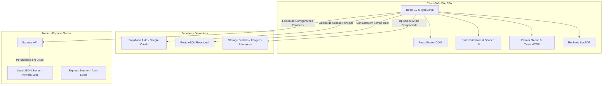
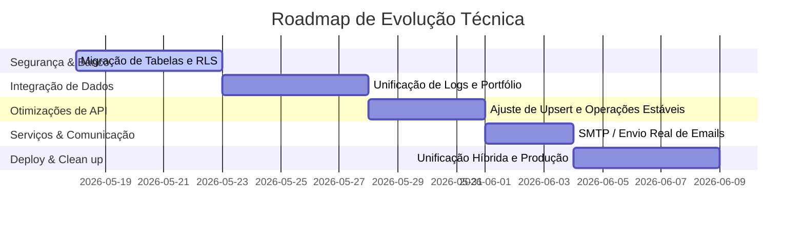

# 🔍 Relatório de Auditoria Técnica Completa — Projeto Barrigudo

> **Status:** 🟢 Finalizado e Pronto para Revisão  
> **Autor:** Engenheiro de Software Sênior Full-Stack  
> **Data:** 18 de Maio de 2026  
> **Projeto:** Barrigudo (Diretório de Profissionais de Serviços Residenciais & CRM SaaS)  

---

## 1. 📋 Visão Geral & Resumo Executivo

O projeto **Barrigudo** é uma plataforma digital inovadora concebida para atuar em duas frentes complementares:
1. **Público Geral:** Um portal de descoberta e captação de leads de alta fidelidade focado em serviços residenciais na região de Massachusetts (EUA), contendo portfólio de alta conversão, avaliações reais de clientes e um assistente interativo multi-etapas de solicitação de orçamentos.
2. **Administração & Profissionais (CRM Multi-Tenant):** Um painel administrativo avançado focado na gestão comercial de ponta a ponta: controle de leads, emissão e precificação de orçamentos (estimates), conciliação financeira de pagamentos, geração dinâmica de notas de serviço em PDF, moderador de depoimentos e estatísticas operacionais completas.

### Resumo do Diagnóstico Técnico
O projeto se destaca por uma **qualidade visual surpreendente** e escolhas técnicas robustas no frontend, com integração nativa ao **Supabase** como backend serverless e suporte parcial para um servidor complementar em **Express (Node.js)**. 

No entanto, o projeto atualmente se comporta como um **híbrido** entre uma aplicação rodando em Vite SPA e uma infraestrutura pronta para Next.js (App Router), contendo também fluxos de dados locais (arquivos JSON na API Express) misturados com fluxos de banco de dados remotos no Supabase. O principal objetivo dessa auditoria é expor com transparência os pontos de atenção críticos (especialmente segurança RLS e unificação de arquitetura) para guiar o time em direção a um produto SaaS seguro, estável e escalável em nível corporativo.

---

## 2. 🏗️ Arquitetura e Tecnologias

A base de código implementa uma arquitetura moderna e reativa, dividida entre soluções serverless (BaaS) e microsserviços locais.



### Principais Bibliotecas e Frameworks Utilizados:
*   **Framework Principal:** React 19 (`react` e `react-dom` ^19.2.4) rodando sobre TypeScript 5.8 e empacotado pelo **Vite 5**.
*   **Roteamento:** `react-router-dom` v6.30.1 gerenciando rotas públicas, fluxo de checkout de leads e área administrativa restrita.
*   **Design & Experiência Visual:** TailwindCSS 3.4 para utilitários, `tailwindcss-animate` para transições, `framer-motion` para animações fluidas e complexas, e componentes fundamentados em Radix UI (acessibilidade nativa).
*   **BaaS (Backend as a Service):** `@supabase/supabase-js` v2.97.0 para autenticação com persistência local e conexões à base PostgreSQL.
*   **Geração de Documentos:** `jspdf` (^4.2.0) e `jspdf-autotable` (^5.0.7) estruturando PDFs de orçamentos elegantes e responsivos diretamente no navegador do usuário.
*   **Análise de Dados:** `recharts` (^2.15.4) gerando os gráficos de conversão de leads e faturamento mensal.
*   **Compactação:** `browser-image-compression` para reduzir o tamanho de mídias de serviços antes do upload no Storage do Supabase.

---

## 3. 📂 Estrutura de Diretórios e Componentes Chave

A base de código está organizada sob a pasta principal `src`, adotando uma estrutura modularizada e muito bem segmentada.

### Mapeamento dos Arquivos Críticos:

*   📂 `src/`
    *   📄 [App.tsx](file:///c:/Desenvolvimento/SiteIhago/Site/src/App.tsx) — **Roteador Central da SPA**. Define todos os caminhos públicos, o ecossistema `/admin` protegido e telas dinâmicas como visualizador público de faturas `/estimate/view/:token`.
    *   📄 [index.css](file:///c:/Desenvolvimento/SiteIhago/Site/src/index.css) — Folha de estilos unificada contendo variáveis CSS do sistema de cores e tokens de glassmorphism.
    *   📂 `config/`
        *   📄 [site.ts](file:///c:/Desenvolvimento/SiteIhago/Site/src/config/site.ts) — **Configuração Mestra**. Armazena a lista de Massachusetts de cidades atendidas (*service areas*), chaves públicas, queries de localização de mapas e tokens estéticos reutilizáveis.
    *   📂 `context/`
        *   📄 [UserContext.tsx](file:///c:/Desenvolvimento/SiteIhago/Site/src/context/UserContext.tsx) — **Gerenciador de Sessão SaaS**. Trata a recuperação do usuário no Supabase, mapeamento dinâmico de múltiplos tenants (organizações) associados e papéis (`role`) de permissão do usuário.
        *   📄 [LanguageContext.tsx](file:///c:/Desenvolvimento/SiteIhago/Site/src/context/LanguageContext.tsx) — Sistema completo de internacionalização (i18n) provendo suporte multilíngue dinâmico (Inglês e Português).
    *   📂 `lib/`
        *   📄 [supabase.ts](file:///c:/Desenvolvimento/SiteIhago/Site/src/lib/supabase.ts) — **Otimização Excepcional**. Declara dois clientes Supabase independentes: `supabase` (com persistência ativa para sessões do painel) e `supabasePublic` (sem persistência, eliminando conflitos de LockManager em abas anônimas de clientes).
        *   📄 [estimates.ts](file:///c:/Desenvolvimento/SiteIhago/Site/src/lib/estimates.ts) — Camada de comunicação com o Supabase para criação, consulta, atualização e faturamento de orçamentos.
        *   📄 [leads.ts](file:///c:/Desenvolvimento/SiteIhago/Site/src/lib/leads.ts) — Funções de salvamento de leads oriundos do formulário wizard.
        *   📄 [pdf-generator.ts](file:///c:/Desenvolvimento/SiteIhago/Site/src/lib/pdf-generator.ts) — Motor gráfico que gera orçamentos estilizados com cabeçalho corporativo, dados do cliente e sumário de itens.
    *   📂 `pages-spa/`
        *   📄 [Index.tsx](file:///c:/Desenvolvimento/SiteIhago/Site/src/pages-spa/Index.tsx) — Landing page principal, renderizando a vitrine de portfólio e mapa de cobertura.
        *   📄 [Quote.tsx](file:///c:/Desenvolvimento/SiteIhago/Site/src/pages-spa/Quote.tsx) — **Wizard de Orçamentação**. Formulário com barra de progresso em porcentagem, honeypot de segurança, consulta instantânea de endereço via Zip Code (Zippopotam.us) e upload de mídia compactada.
        *   📄 [Experiences.tsx](file:///c:/Desenvolvimento/SiteIhago/Site/src/pages-spa/Experiences.tsx) — Interface interativa focada em coletar feedbacks avançados de serviços prestados.
        *   📂 `admin/`
            *   📄 [Dashboard.tsx](file:///c:/Desenvolvimento/SiteIhago/Site/src/pages-spa/admin/Dashboard.tsx) — Estatísticas vitais operacionais, faturamento, receita líquida pendente e logs de sessões.
            *   📄 [EstimateEditor.tsx](file:///c:/Desenvolvimento/SiteIhago/Site/src/pages-spa/admin/EstimateEditor.tsx) — Painel de faturamento completo, com manipulação de impostos, descontos, prazos legais de validade e conciliação de pagamentos.
            *   📄 [CompanySettings.tsx](file:///c:/Desenvolvimento/SiteIhago/Site/src/pages-spa/admin/CompanySettings.tsx) — Customização da identidade corporativa (Logo da empresa, taxas tributárias padrão e termos de serviço).

---

## 4. 🗄️ Mapeamento de Banco de Dados (Supabase)

O banco de dados relacional remoto foi modelado para suportar RLS (Row Level Security) e arquitetura SaaS multi-tenant baseada em tabelas de relacionamento.

### Tabelas Mapeadas na Aplicação:

```mermaid
erDiagram
    organizations {
        uuid id PK
        text name
        text slug
    }
    organization_users {
        uuid id PK
        uuid user_id FK
        uuid organization_id FK
        text role
    }
    leads {
        uuid id PK
        uuid organization_id FK
        text fullName
        text email
        text phone
        text zip
        text selectedServiceOption
        text status
        timestamp createdAt
    }
    estimates {
        uuid id PK
        uuid organization_id FK
        uuid lead_id FK
        text client_name
        text client_email
        text status
        numeric subtotal
        numeric tax_rate
        numeric total_amount
        numeric amount_paid
        numeric balance_due
        text public_token
        timestamp created_at
    }
    estimate_items {
        uuid id PK
        uuid estimate_id FK
        uuid organization_id FK
        text description
        numeric quantity
        numeric unit_price
        numeric total_price
    }
    estimate_payments {
        uuid id PK
        uuid organization_id FK
        uuid estimate_id FK
        numeric amount
        text payment_method
        timestamp payment_date
    }
    reviews {
        uuid id PK
        uuid user_id FK
        text user_name
        integer rating
        text body
        boolean is_hidden
        timestamp created_at
    }

    organizations ||--o{ organization_users : contains
    organizations ||--o{ leads : manages
    organizations ||--o{ estimates : owns
    estimates ||--o{ estimate_items : contains
    estimates ||--o{ estimate_payments : registers
}
```

### Avaliação do Estado do Banco de Dados:
1.  **Reviews:** Possui migração nativa estruturada (`remote_setup.sql`) contendo índices otimizados por data e políticas RLS detalhadas (leitura pública para reviews não-ocultos, e escrita estrita a usuários autenticados proprietários).
2.  **Organizações & Tenants:** O [UserContext.tsx](file:///c:/Desenvolvimento/SiteIhago/Site/src/context/UserContext.tsx) busca dados na tabela `organization_users` para verificar as permissões corporativas do usuário logado.
3.  **Faturamento & CRM:** As tabelas `estimates`, `estimate_items` e `estimate_payments` possuem modelos de transações sólidos definidos na camada de API cliente.
4.  **🚨 GAP CRÍTICO DE RLS:** A aplicação frontend executa queries de escrita e leitura nas tabelas `leads` e `estimates` usando a chave anônima pública do Supabase. **Se essas tabelas não possuírem Row Level Security (RLS) habilitado e com políticas ativas em produção**, qualquer pessoa com acesso à chave anônima (exposta na rede do cliente) poderá ler, modificar ou apagar informações confidenciais de orçamentos e clientes do banco de dados executando requisições diretas à API.

---

## 5. 🔄 Mapeamento de Fluxos & Funcionalidades

Para clareza no planejamento, dividimos as funcionalidades do projeto de acordo com o seu nível atual de maturidade técnica e dependências.

| Funcionalidade | Tipo | Estado Atual | Detalhamento Técnico |
| :--- | :---: | :---: | :--- |
| **Wizard de Orçamentação** | Pública | 🟢 100% Funcional | Assistente com validação ZIP, honeypot, upload e barra de progresso. |
| **Geração de PDF** | Admin | 🟢 100% Funcional | jsPDF gera o orçamento de forma vetorizada com logo e taxas. |
| **Autenticação Admin** | Admin | 🟢 100% Funcional | Supabase Auth via Google OAuth integrado ao fluxo da aplicação. |
| **Dual Client Contention Fix** | Sistema | 🟢 100% Funcional | Alternância de clients Supabase para evitar contenção de trava. |
| **Tradução Multilíngue (i18n)** | Global | 🟢 100% Funcional | Idioma alternado dinamicamente via `LanguageProvider`. |
| **Editor de Orçamentos (Salvar)** | CRM | 🟡 Parcialmente Pronto | Abordagem destrutiva de Delete-and-Insert para atualizar itens de orçamentos (`estimate_items`), que pode quebrar constraints se pagamentos estiverem atrelados. |
| **Faturamento Dinâmico (Taxas)** | CRM | 🟢 100% Funcional | Atualização e recálculo dinâmico de saldos, descontos e impostos. |
| **Envio de Emails** | Admin | 🔴 Incompleto (Mock) | Precisa de integração com servidores de email de produção (ex. SMTP/Resend). |
| **Logs de Login do Painel** | Admin | 🔴 Local / Mock | No Express, salva localmente em JSON (`login-attempts.json`); na SPA restringe a um mock vazio para compilar o UI. |
| **Galeria & Portfólio** | Pública | 🔴 Local / Mock | Utiliza persistência local no Express. Precisa de migração total para tabelas do Supabase. |

---

## 6. 🔒 Segurança & Vulnerabilidades

A segurança do ecossistema foi analisada do nível de proteção do usuário até as regras de infraestrutura e tráfego de dados.

### Pontos Fortes Implementados:
*   **Anti-Spam (Honeypot):** O campo oculto `websiteUrl` implementado no formulário progressivo impede eficazmente o envio automatizado por bots mal-intencionados.
*   **Dual Client isolation:** Evita falhas críticas de `LockManager` em navegadores Safari/Mobile em abas de navegação pública (onde persistência não é necessária).
*   **Limitação de Taxa de Requisição (Rate Limiting):** O backend Express possui limitador dinâmico de IPs para o endpoint de login, reduzindo riscos de ataques de força bruta.

### Vulnerabilidades & Riscos Potenciais:
1.  **Exposição de Chaves Supabase:** As chaves de acesso públicas (`NEXT_PUBLIC_SUPABASE_URL` e `NEXT_PUBLIC_SUPABASE_ANON_KEY`) são enviadas ao navegador. Sem RLS restrito no banco, isso equivale a abrir a porta do banco a qualquer hacker.
2.  **Operações Destrutivas de Atualização:** A função [updateEstimate](file:///c:/Desenvolvimento/SiteIhago/Site/src/lib/estimates.ts#L123-L165) apaga os itens anteriores e reinsere-os na atualização do orçamento. Caso no futuro outros módulos referenciem os IDs das linhas de itens removidas, haverá quebra imediata de chave estrangeira no PostgreSQL.
3.  **Logs Desconectados:** Logs de falhas de segurança salvos localmente em disco (`.json`) em ambiente serverless (como Vercel) são deletados automaticamente sempre que a instância do servidor recarrega (cold start).

---

## 7. 🎨 Análise de Design & Estética

O projeto atende com maestria às diretrizes estéticas modernas, entregando uma interface digna de produtos SaaS corporativos consolidados.

*   **Identidade Visual:** Paleta refinada com azul-marinho profundo (`#0b2a4a`) transmitindo profissionalismo e solidez, acompanhado por verdes harmoniosos para indicar status positivo (Paid, Approved) e laranjas vibrantes para urgência (Balance due, Warning).
*   **Tipografia e Hierarquia:** Utilização de fontes modernas, estruturadas e escalonadas com tamanhos proporcionais. Títulos em negrito pesado contrastam perfeitamente com textos auxiliares em cinzas de alta legibilidade.
*   **Interatividade & Feedback:**
    *   Presença de micro-animações suaves em hover (botões com escala leve e elevação de sombra).
    *   Simulador dinâmico de números crescentes (`AnimatedNumber`) na inicialização do dashboard gerando experiência de alta qualidade.
    *   Barra de progresso animada ao preencher o wizard de cotações que aumenta o engajamento e conversão de leads.
*   **Responsividade:** O painel administrativo colapsa de forma fluida em telas menores, mantendo o grid perfeitamente alinhado e legível em tablets e smartphones.

---

## 8. 📊 Log de Problemas Priorizados

Listamos a seguir os problemas encontrados, divididos por prioridade técnica para tomada de ação.

| ID | Severidade | Módulo | Descrição do Problema | Ação Recomendada |
| :--- | :---: | :---: | :--- | :--- |
| **01** | 🔥 Crítico | Supabase | Ausência de políticas RLS em tabelas centrais (`leads`, `estimates`, `estimate_items`). | Criar script DDL ativando RLS e aplicando cláusulas `USING (auth.uid() = user_id)`. |
| **02** | 🟥 Alto | Sistema | Inconsistência arquitetural (Next.js vs Vite SPA rodando simultaneamente). | Decidir e unificar a base tecnológica (ex. utilizar build exclusivo SPA ou migrar totalmente para Next.js). |
| **03** | 🟨 Médio | API | Abordagem destrutiva de Delete-and-Insert para atualizar itens no editor de orçamentos. | Modificar a função de update para realizar operações de `upsert` com base em IDs. |
| **04** | 🟨 Médio | Portfólio | Portfólio persistido localmente via JSON em disco na API Express. | Criar tabelas `portfolio_items` e `portfolio_categories` no Supabase e migrar os dados. |
| **05** | 🟩 Baixo | UI/UX | Timeout fixo de 5s na checagem de sessão pode ejetar usuários legítimos com conexões lentas. | Incrementar o timeout ou exibir indicador visual discreto de recarregamento sem bloqueio. |

---

## 9. 🚀 Roadmap de Evolução (Passo a Passo)

Apresentamos o roadmap sequencial planejado para converter este protótipo funcional em uma plataforma SaaS robusta e profissional de alta escala.



### Detalhamento das Etapas do Roadmap:

1.  **Etapa 1: Endurecimento do Banco de Dados (DDL & RLS)**
    *   Escrever e aplicar migrações contendo as tabelas `estimates`, `estimate_items`, `estimate_payments` e `leads`.
    *   Habilitar Row Level Security (RLS) e programar políticas de segurança relacionando as linhas das tabelas com os tenants (`organization_id` correspondentes ao usuário ativo).
2.  **Etapa 2: Migração do Portfólio para Supabase**
    *   Migrar a estrutura estática do portfólio (atualmente local) para tabelas reais no PostgreSQL do Supabase, facilitando a edição dinâmica via painel administrativo.
3.  **Etapa 3: Estabilização de Operações no Banco**
    *   Refatorar a atualização de itens de orçamentos na API [estimates.ts](file:///c:/Desenvolvimento/SiteIhago/Site/src/lib/estimates.ts) substituindo o método destrutivo de exclusão por um método inteligente de `upsert` que rastreia os itens existentes.
4.  **Etapa 4: Unificação dos Logs de Login**
    *   Substituir a escrita de logs local (`login-attempts.json`) por uma tabela indexada no Supabase (`login_attempts`), permitindo auditoria centralizada do painel mesmo em instâncias dinâmicas e serverless.
5.  **Etapa 5: Conectores de Comunicação de Produção**
    *   Configurar provedor SMTP seguro ou serviço serverless (como Resend ou SendGrid) para disparar notificações automáticas quando orçamentos forem visualizados ou aprovados.
6.  **Etapa 6: Gateway de Pagamentos**
    *   Acoplar links seguros para faturamento automático integrado (como Stripe ou Mercado Pago), atualizando o status do orçamento para "Paid" na conciliação instantânea por webhook.
7.  **Etapa 7: Unificação Arquitetural da Base**
    *   Decidir o modelo definitivo de empacotamento: desativar a configuração Next.js e focar 100% no ecossistema SPA empacotado por Vite (altamente estável) ou reestruturar as páginas SPA dentro do diretório `app` do Next.js.
8.  **Etapa 8: Integrações de Geolocalização Reais**
    *   Integrar de forma robusta o mapa de serviços dinâmico para validar se o Zip Code digitado no wizard está dentro da cobertura programada pela empresa antes de criar o lead.
9.  **Etapa 9: Validação e Testes Automatizados**
    *   Construir suíte de testes unitários e de integração utilizando o `vitest` (já configurado no projeto) para cobrir cálculos financeiros de taxas, amortizações e validações de formulário.
10. **Etapa 10: Deploy de Produção e CI/CD**
    *   Subir o projeto unificado na infraestrutura da Vercel ou Supabase Edge Hosting com pipelines automatizados ligando o repositório Git de produção.

---
> **Fim do Relatório.** Este material está salvo em seu projeto no caminho `c:\Desenvolvimento\SiteIhago\Site\technical_audit_report.md` para discussões presenciais e planejamento da próxima etapa operacional.
